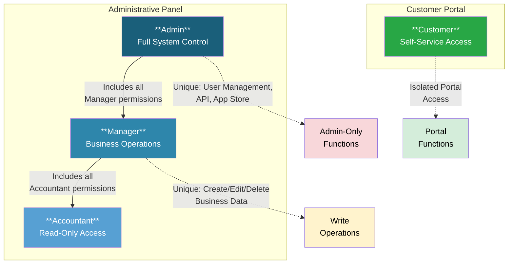

# User Roles and Permissions

<!-- Source: app/Models/Auth/Role.php, app/Models/Auth/Permission.php, app/Models/Auth/User.php, app/Models/Auth/UserCompany.php, database/seeds/Permissions.php -->

## Overview

Akaunting uses role-based access control (RBAC) to manage what each user can see and do within the application. Every user is assigned one or more roles, and each role grants specific permissions across the system's functional areas.

---

## Available Roles

Akaunting includes four predefined roles that cover common business needs:

### Admin

The **Admin** role has complete control over all aspects of the application. Admins can manage users, configure system settings, install apps from the App Store, and perform all business operations. This role is typically assigned to business owners or IT administrators.

**Key Capabilities:**
- Full access to all sales, purchases, and banking functions
- User management (create, edit, delete users)
- System settings configuration
- App Store access and module installation
- API access for integrations

### Manager

The **Manager** role provides broad operational access without system administration capabilities. Managers can perform all day-to-day business operations including invoicing, bill management, and banking but cannot manage users or access the App Store.

**Key Capabilities:**
- Full access to sales, purchases, and banking functions
- Access to all reports and dashboards
- Settings configuration (company, categories, taxes, currencies)
- Cannot manage other users
- Cannot install or manage apps/modules

### Accountant

The **Accountant** role provides read-only access to financial data for external accountants or auditors. Accountants can view all business transactions and generate reports but cannot create, edit, or delete any records.

**Key Capabilities:**
- View-only access to invoices, bills, and transactions
- Access to all financial reports
- View banking accounts and reconciliations
- View customer and vendor records
- Cannot create, modify, or delete any data

### Customer

The **Customer** role is exclusively for customer portal access. Customers can view their invoices, make payments, and manage their profile through a self-service portal. They have no access to the administrative interface.

**Key Capabilities:**
- View invoices issued to them
- Make online payments
- Download invoice PDFs
- Update their profile information
- No access to admin panel

---

## Permission Matrix

The following table shows which actions each role can perform across Akaunting's functional areas. Permissions follow the Create (C), Read (R), Update (U), Delete (D) model.

### Sales Permissions

| Feature | Admin | Manager | Accountant | Customer |
|---------|:-----:|:-------:|:----------:|:--------:|
| Invoices – Create | ✓ | ✓ | ✗ | ✗ |
| Invoices – View | ✓ | ✓ | ✓ | ✓* |
| Invoices – Edit | ✓ | ✓ | ✗ | ✗ |
| Invoices – Delete | ✓ | ✓ | ✗ | ✗ |
| Customers – Create | ✓ | ✓ | ✗ | ✗ |
| Customers – View | ✓ | ✓ | ✓ | ✗ |
| Customers – Edit | ✓ | ✓ | ✗ | ✗ |
| Customers – Delete | ✓ | ✓ | ✗ | ✗ |

*Customers can only view their own invoices through the portal.

### Purchases Permissions

| Feature | Admin | Manager | Accountant | Customer |
|---------|:-----:|:-------:|:----------:|:--------:|
| Bills – Create | ✓ | ✓ | ✗ | ✗ |
| Bills – View | ✓ | ✓ | ✓ | ✗ |
| Bills – Edit | ✓ | ✓ | ✗ | ✗ |
| Bills – Delete | ✓ | ✓ | ✗ | ✗ |
| Vendors – Create | ✓ | ✓ | ✗ | ✗ |
| Vendors – View | ✓ | ✓ | ✓ | ✗ |
| Vendors – Edit | ✓ | ✓ | ✗ | ✗ |
| Vendors – Delete | ✓ | ✓ | ✗ | ✗ |

### Banking Permissions

| Feature | Admin | Manager | Accountant | Customer |
|---------|:-----:|:-------:|:----------:|:--------:|
| Accounts – Create | ✓ | ✓ | ✗ | ✗ |
| Accounts – View | ✓ | ✓ | ✓ | ✗ |
| Accounts – Edit | ✓ | ✓ | ✗ | ✗ |
| Accounts – Delete | ✓ | ✓ | ✗ | ✗ |
| Transactions – Create | ✓ | ✓ | ✗ | ✗ |
| Transactions – View | ✓ | ✓ | ✓ | ✗ |
| Transactions – Edit | ✓ | ✓ | ✗ | ✗ |
| Transactions – Delete | ✓ | ✓ | ✗ | ✗ |
| Transfers – Create | ✓ | ✓ | ✗ | ✗ |
| Transfers – View | ✓ | ✓ | ✓ | ✗ |
| Transfers – Edit | ✓ | ✓ | ✗ | ✗ |
| Transfers – Delete | ✓ | ✓ | ✗ | ✗ |
| Reconciliations – Create | ✓ | ✓ | ✗ | ✗ |
| Reconciliations – View | ✓ | ✓ | ✓ | ✗ |
| Reconciliations – Edit | ✓ | ✓ | ✗ | ✗ |
| Reconciliations – Delete | ✓ | ✓ | ✗ | ✗ |

### Reports Permissions

| Report Type | Admin | Manager | Accountant | Customer |
|-------------|:-----:|:-------:|:----------:|:--------:|
| Income Summary | ✓ | ✓ | ✓ | ✗ |
| Expense Summary | ✓ | ✓ | ✓ | ✗ |
| Income vs Expense Summary | ✓ | ✓ | ✓ | ✗ |
| Profit & Loss | ✓ | ✓ | ✓ | ✗ |
| Tax Summary | ✓ | ✓ | ✓ | ✗ |
| Discount Summary | ✓ | ✓ | ✓ | ✗ |
| Custom Reports – Create | ✓ | ✓ | ✗ | ✗ |

### Settings Permissions

| Setting Area | Admin | Manager | Accountant | Customer |
|--------------|:-----:|:-------:|:----------:|:--------:|
| Company Settings | ✓ | ✓ | ✗ | ✗ |
| Categories | ✓ | ✓ | ✗ | ✗ |
| Currencies | ✓ | ✓ | ✗ | ✗ |
| Taxes | ✓ | ✓ | ✗ | ✗ |
| Default Settings | ✓ | ✓ | ✗ | ✗ |
| Invoice Settings | ✓ | ✓ | ✗ | ✗ |
| Email Settings | ✓ | ✓ | ✗ | ✗ |
| Email Templates | ✓ | ✓ | ✗ | ✗ |
| Localisation | ✓ | ✓ | ✗ | ✗ |
| Scheduling | ✓ | ✓ | ✗ | ✗ |

### Administration Permissions

| Feature | Admin | Manager | Accountant | Customer |
|---------|:-----:|:-------:|:----------:|:--------:|
| User Management | ✓ | ✗ | ✗ | ✗ |
| Company Management | ✓ | ✓ | ✗ | ✗ |
| App Store Access | ✓ | ✗ | ✓** | ✗ |
| App Installation | ✓ | ✗ | ✗ | ✗ |
| System Updates | ✓ | ✓ | ✗ | ✗ |
| API Access | ✓ | ✗ | ✓ | ✗ |
| Dashboard Customization | ✓ | ✓ | ✗ | ✗ |
| Widget Management | ✓ | ✓ | ✗ | ✗ |

**Accountants can browse the App Store but cannot install apps.

### Portal Permissions (Customer Role Only)

| Feature | Customer |
|---------|:--------:|
| View Own Invoices | ✓ |
| Download Invoice PDF | ✓ |
| Print Invoices | ✓ |
| Make Payments | ✓ |
| View Payment History | ✓ |
| Update Profile | ✓ |

---

## Multi-Company Access

Akaunting supports multi-company functionality, allowing users to work with multiple business entities from a single account.

### How Multi-Company Access Works

- Each user can be associated with one or more companies
- Access rights are determined by the role assigned within each company
- Users switch between companies using the company selector in the navigation menu
- A user may have different roles in different companies (for example, Admin in one company and Accountant in another)

### Company Switching

The user navigates to the company selector in the top navigation bar and selects the company they wish to work with. All subsequent actions will apply to the selected company until they switch again. Data from one company is completely isolated from other companies.

### Adding Users to Companies

Admins can invite users to a company through **Settings > Users**. When inviting a user, the Admin specifies which role the user will have within that company.

---

## Role Hierarchy Diagram

The following diagram illustrates the relationship between roles and their access levels:

### Key Points

1. **Admin** has all permissions that Manager has, plus user management, API access, and App Store control
2. **Manager** has all permissions that Accountant has, plus the ability to create, edit, and delete business data
3. **Accountant** has read-only access to business data and reports
4. **Customer** operates in a completely separate portal with no overlap with administrative roles

---

## See Also

- [Capabilities Inventory](capabilities-inventory.md) – Complete list of Akaunting features by functional area
- [Validation Rules](../04-business-rules/validation-rules.md) – Field validation requirements for data entry
- [Invoice Creation and Payment Flow](../02-user-flows/invoice-creation-and-payment/flow-document.md) – Step-by-step guide to creating invoices
