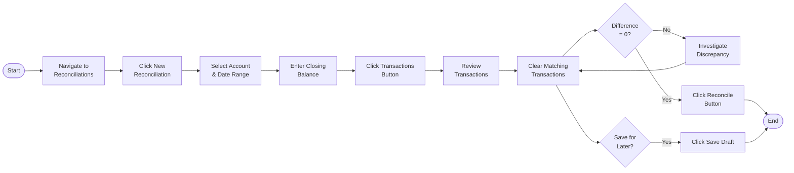
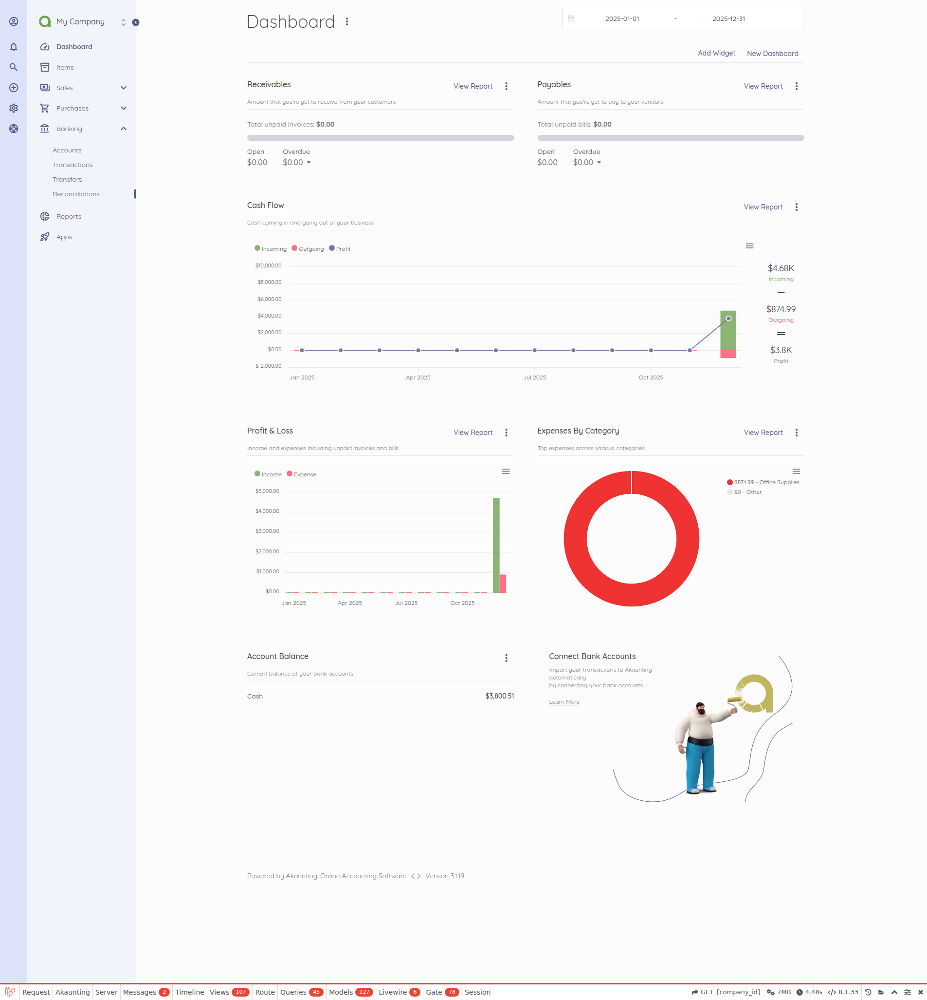
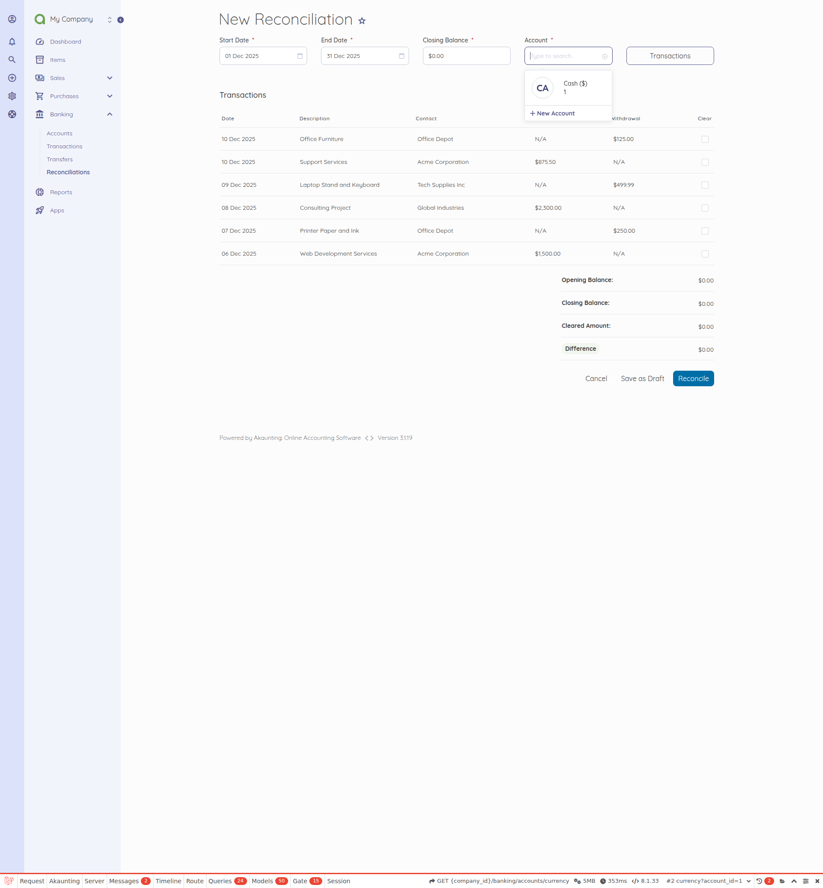
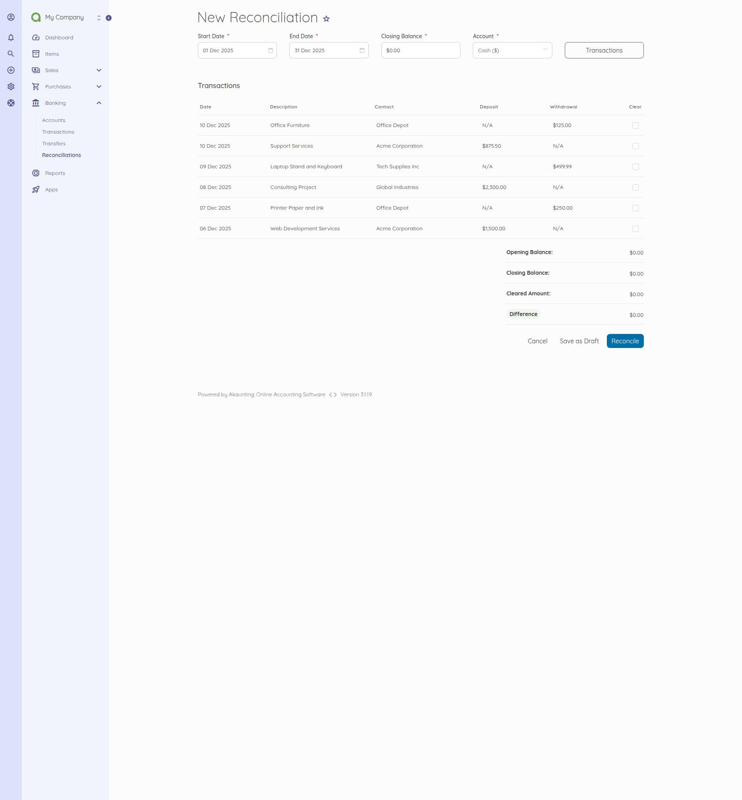
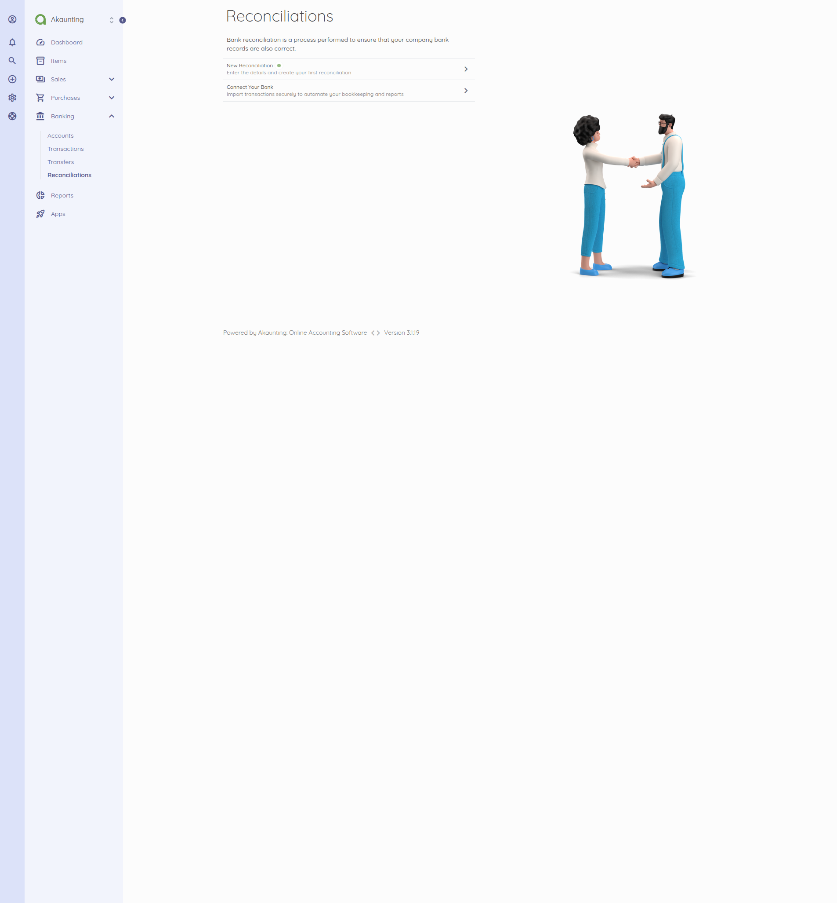
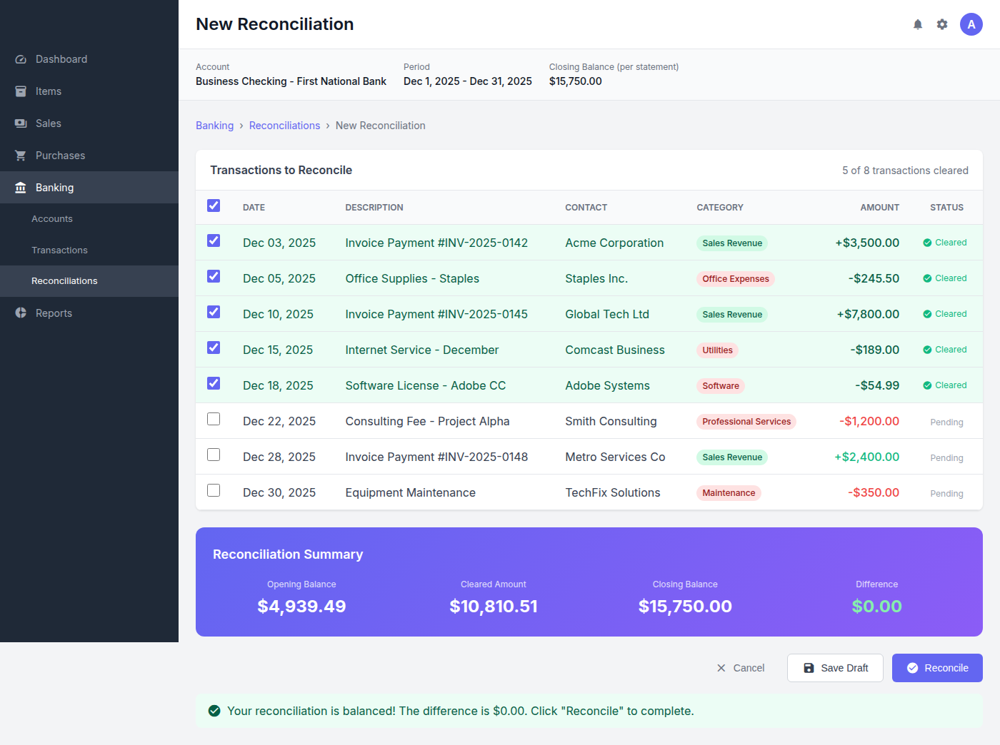

# Bank Reconciliation

<!-- Source: app/Http/Controllers/Banking/Reconciliations.php, app/Models/Banking/Reconciliation.php -->

## Overview

Bank reconciliation ensures that your financial records in Akaunting accurately match your actual bank statement activity. The user compares transactions recorded in the system against their bank statement to verify that all income and expenses are correctly captured, identify any discrepancies, and confirm the account balance is accurate.

---

## Prerequisites

Before starting a bank reconciliation, ensure the following are in place:

- **Bank Account Configured** – At least one bank account must be set up in Akaunting under Banking > Accounts
- **Transactions Recorded** – Income and expense transactions must be entered for the reconciliation period
- **Bank Statement Available** – Have your bank statement ready (paper or digital) with the closing balance and transaction details
- **User Permissions** – The user must have `read-banking-reconciliations` and `create-banking-reconciliations` permissions assigned to their role

---

## Flow Diagram

---

## Step-by-Step Breakdown

### Step 1: Navigate to Banking > Reconciliations

The user begins by accessing the reconciliation area from the main menu. Click **Banking** in the left sidebar navigation, then select **Reconciliations** from the submenu that appears. The reconciliation list page displays any existing reconciliations, showing their status as either "Reconciled" (completed) or "In Progress" (saved as draft). The page also shows summary amounts for reconciled and in-progress reconciliations.

---

### Step 2: Start New Reconciliation

To begin a new reconciliation, the user clicks the **New Reconciliation** button located at the top right of the page. This opens the reconciliation creation form where the user selects which bank account to reconcile from the **Account** dropdown menu. The account dropdown defaults to the company's default bank account, but any configured account can be selected. The selected account's currency will be used for all calculations.

---

### Step 3: Set Date Range and Closing Balance

The user enters the reconciliation period by setting the **Start Date** and **End Date** fields to match their bank statement period. The dates default to the current month (first day to last day), but can be adjusted to any range. The user then enters the **Closing Balance** exactly as shown on their bank statement—this is the target balance that the reconciliation must match. After entering these details, the user clicks the **Transactions** button to load all transactions within the selected date range.

---

### Step 4: Review and Clear Transactions

The system displays a table of all transactions recorded within the date range, organized by date. Each transaction row shows the date, description, contact name, and either a **Deposit** amount (for income) or **Withdrawal** amount (for expenses). The user reviews each transaction against their bank statement and checks the **Clear** checkbox next to transactions that match entries on the bank statement. As transactions are cleared, the system automatically recalculates the **Cleared Amount** (opening balance plus deposits minus withdrawals for cleared items) and the **Difference** (closing balance minus cleared amount).

---

### Step 5: Complete Reconciliation

As the user clears transactions, the summary section at the bottom updates to show: **Opening Balance** (automatically calculated from prior transactions), **Closing Balance** (entered from bank statement), **Cleared Amount** (running total of cleared transactions), and **Difference** (closing balance minus cleared amount). When the difference reaches zero, the **Reconcile** button becomes active. The user clicks **Reconcile** to finalize the reconciliation and mark all cleared transactions as reconciled. If unable to complete the reconciliation immediately, the user can click **Save Draft** to save progress and return later.

---

## Variations

- **Save as Draft** – If the user cannot complete the reconciliation in one session, they can click **Save Draft** to preserve their progress. The reconciliation will appear as "In Progress" on the reconciliation list and can be reopened to continue later.

- **Partial Reconciliation** – The user may choose not to clear certain transactions if discrepancies need investigation. These uncleared transactions remain unreconciled and will appear in future reconciliation attempts.

- **Edit Existing Reconciliation** – In-progress (draft) reconciliations can be reopened from the reconciliation list by clicking on the entry. The user can modify cleared transactions and update the reconciliation.

- **Recurring Reconciliation** – Most businesses perform bank reconciliation monthly at the end of each month. After completing one reconciliation, the user starts a new one for the next period, with dates automatically advancing.

- **Multiple Accounts** – Businesses with multiple bank accounts should reconcile each account separately by selecting the appropriate account when creating a new reconciliation.

---

## Related Workflows

- **Transaction Recording** – Before reconciliation, the user should ensure all income (payments received) and expense (payments made) transactions are recorded in the system. See [Transaction Management](../../01-capabilities-overview/capabilities-inventory.md#transaction-management) in the capabilities inventory.

- **Bank Account Management** – Bank accounts must be configured before reconciliation can begin. The user can create accounts under Banking > Accounts with opening balances and currency settings.

- **Transaction Categorization** – Assigning categories to transactions helps with reporting accuracy. Proper categorization should be verified during reconciliation review.

- **Transfer Recording** – Transfers between bank accounts (e.g., moving funds from checking to savings) must be recorded separately and will appear in reconciliation for both accounts.

---

## See Also

- [Capabilities Inventory](../../01-capabilities-overview/capabilities-inventory.md) – Complete list of Akaunting business capabilities including Banking features
- [Validation Rules](../../04-business-rules/validation-rules.md) – Field validation requirements for reconciliation data entry
- [Error Handling](../../04-business-rules/error-handling.md) – Common error messages and resolution guidance
