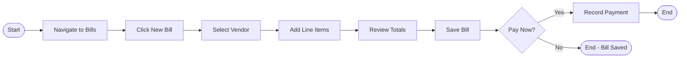
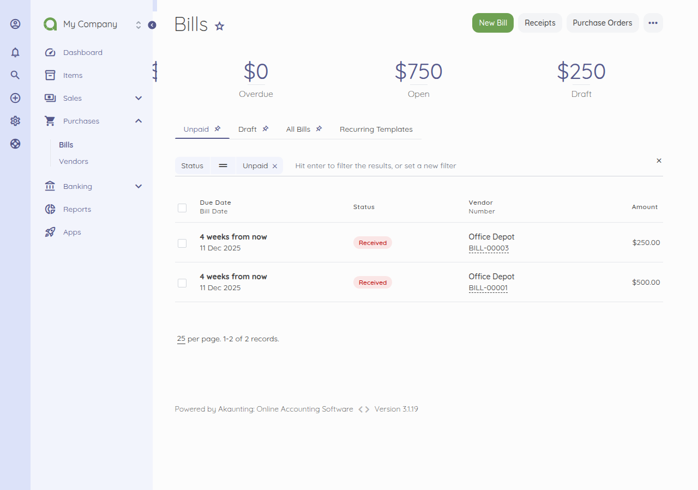
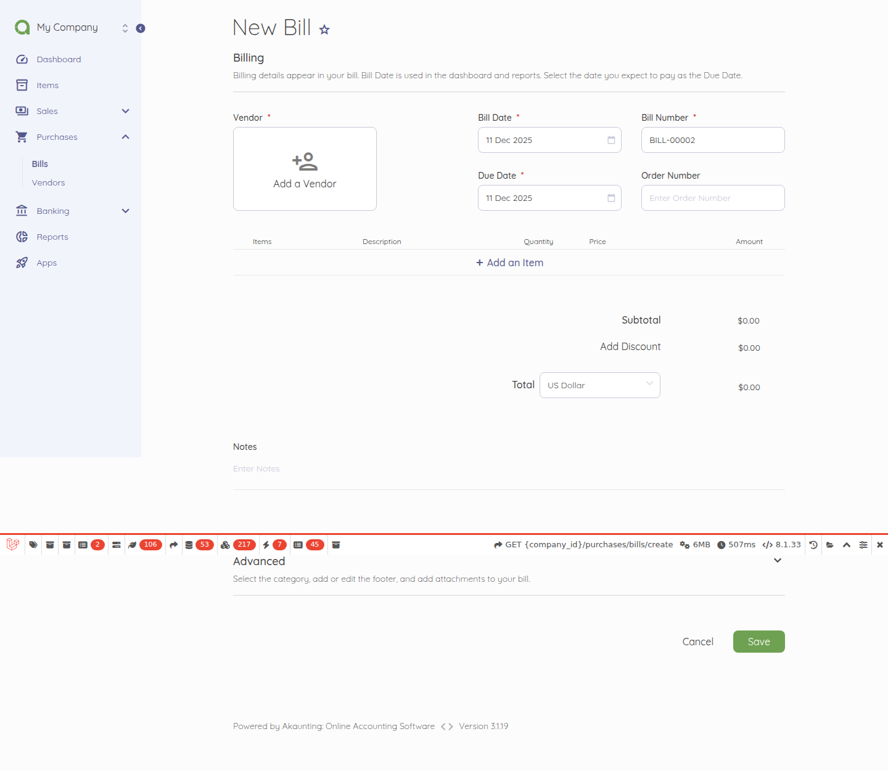
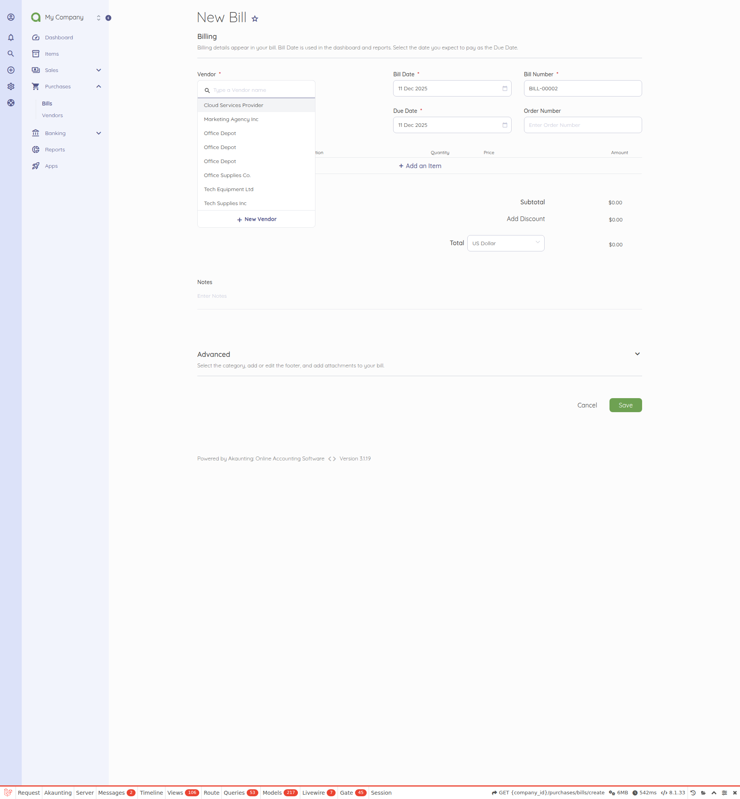
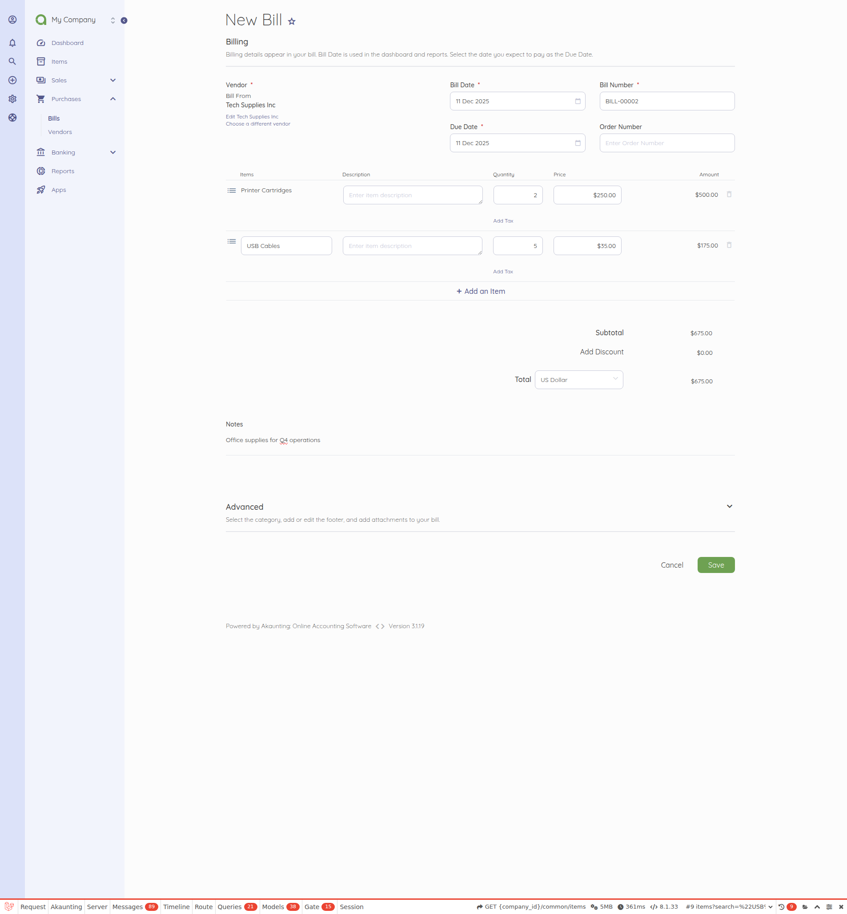
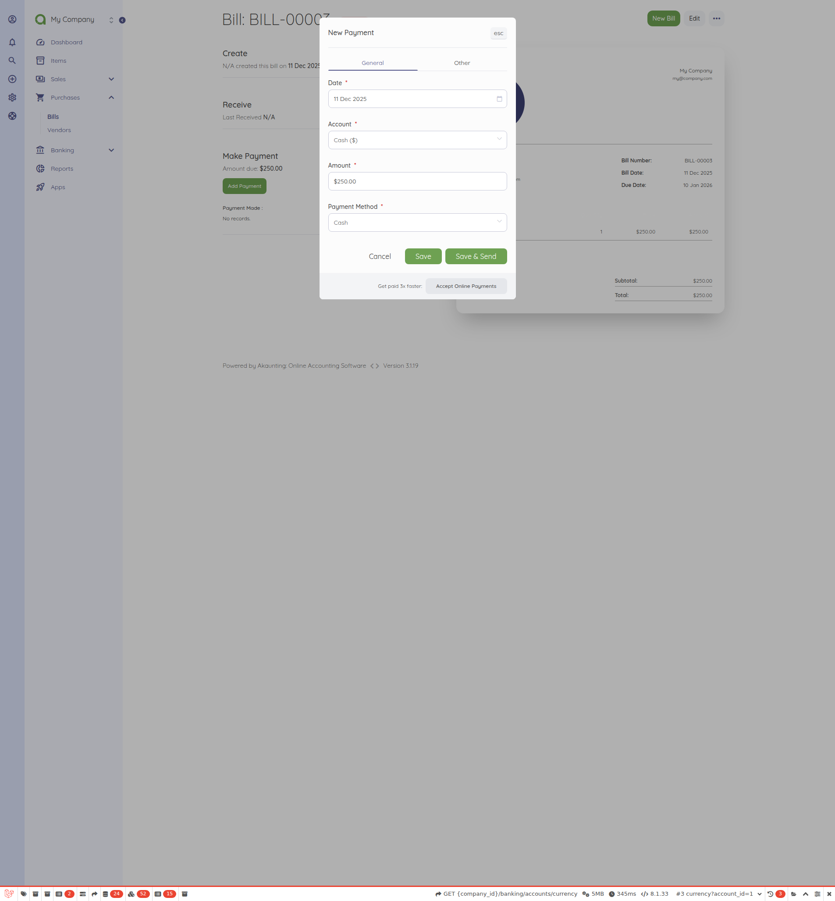

# Bill Recording and Payment

<!-- Source: app/Http/Controllers/Purchases/Bills.php, app/Http/Controllers/Modals/DocumentTransactions.php -->

## Overview

This workflow enables users to track business expenses by recording vendor bills and managing payments. Recording bills from vendors and tracking when payments are made ensures accurate accounts payable management and helps maintain healthy vendor relationships.

## Prerequisites

Before recording a bill, ensure the following are in place:

- **Vendor contact exists**: At least one vendor must be created in the system (navigate to Purchases > Vendors to add vendors)
- **Items or categories configured**: Products, services, or expense categories should be set up for use as bill line items
- **Bank account available**: A bank account must be configured to record payments against bills
- **User permissions**: The user must have the 'create-purchases-bills' and 'update-purchases-bills' permissions assigned to their role

## Flow Diagram

The following diagram illustrates the complete bill recording and payment workflow:

## Step-by-Step Breakdown

### Step 1: Navigate to Purchases > Bills

The user clicks **Purchases** in the main navigation menu, then selects **Bills** from the submenu that appears. The bills list page displays all existing bills organized by date, showing key information including bill number, vendor name, amount, and current status. Bills are color-coded by status: Draft (gray), Received (blue), Partial (yellow), Paid (green), or Cancelled (red).

### Step 2: Click New Bill Button

The user clicks the **New Bill** button located in the top-right area of the bills list page. This opens the bill creation form with empty fields ready for data entry. The form is organized into logical sections for vendor information, line items, and billing details.

### Step 3: Select Vendor

The user selects a vendor from the **Contact** dropdown field at the top of the form. Once a vendor is selected, their currency automatically populates based on their profile settings. The bill number is auto-generated according to the company's numbering configuration (found in Settings > Invoice). The user can also set the **Bill Number** manually if custom numbering is preferred.

### Step 4: Add Line Items

The user adds one or more line items by clicking the **Add Item** button or selecting from existing items in the dropdown. For each line item, the user enters:
- **Item/Description**: The product, service, or expense description
- **Quantity**: The number of units being billed
- **Price**: The purchase price per unit

The system automatically calculates line totals and applies any configured tax rates. Users can add multiple line items as needed by clicking the add button again.

### Step 5: Review and Save Bill

The user reviews the calculated amounts displayed at the bottom of the form, including subtotal, applicable taxes, and the grand total. Additional options available before saving include:
- **Billed At**: The date the bill was issued (defaults to today)
- **Due At**: The payment due date
- **Order Number**: An optional reference number from the vendor
- **Notes**: Any additional information about the bill
- **Attachment**: Upload supporting documents such as the original invoice or receipt

The user clicks **Save** to create the bill. The bill status is set to "Received" indicating it has been entered into the system and is awaiting payment.

### Step 6: Record Payment

From the bill detail page, the user clicks the **Add Payment** button to record a payment against the bill. A payment modal appears where the user enters:
- **Amount**: The payment amount (defaults to the remaining balance)
- **Paid At**: The date the payment was made
- **Account**: The bank account from which the payment was made
- **Payment Method**: How the payment was made (bank transfer, check, cash, etc.)
- **Reference**: An optional reference number for the payment

After saving the payment, the bill status automatically updates to "Paid" if the full amount has been paid, or "Partial" if only a portion of the bill has been paid. Multiple payments can be recorded against a single bill until the balance reaches zero.

## Variations

The standard bill recording workflow supports several variations to accommodate different business scenarios:

- **Recurring Bills**: For regular vendor payments (such as rent, subscriptions, or retainers), users can create recurring bill templates by navigating to Purchases > Recurring Bills. These automatically generate new bills at scheduled intervals.

- **Partial Payments**: When a bill cannot be paid in full, users can record multiple partial payments over time. Each payment is tracked separately, and the bill status remains "Partial" until the full amount is paid.

- **Bill Duplication**: To save data entry time for similar purchases, users can duplicate an existing bill by clicking the **Duplicate** option in the bill actions menu. This creates a new bill with the same vendor, items, and amounts.

- **Mark as Cancelled**: If a bill was entered in error or is no longer valid, users can cancel it by selecting **Mark as Cancelled** from the bill actions menu. Cancelled bills remain in the system for record-keeping but are excluded from financial calculations.

- **Import Bills**: For bulk entry, bills can be imported from CSV or Excel files by clicking the **Import** button on the bills list page. This is useful when migrating data from another system or entering multiple bills at once.

- **Export Bills**: Users can export bill data to Excel format for reporting or backup purposes using the **Export** button on the bills list page.

## Related Workflows

The bill recording workflow connects to several other Akaunting workflows:

- **Vendor Management**: Creating and managing vendor contacts is a prerequisite for recording bills. Navigate to Purchases > Vendors to add new vendors with their contact details, default currency, and payment terms.

- **Expense Recording**: For quick expense entry without creating a formal bill, users can record transactions directly through Banking > Transactions. This is useful for small or one-time expenses that don't require vendor tracking.

- **Invoice Creation**: The bill recording workflow mirrors the invoice creation process but from the opposite perspective. While bills track money owed to vendors (payables), invoices track money owed by customers (receivables).

- **Bank Reconciliation**: Recorded bill payments appear as transactions in the associated bank account. These can be reconciled against bank statements through the Banking > Reconciliations workflow.

## See Also

- [Capabilities Inventory](../../01-capabilities-overview/capabilities-inventory.md) - Complete reference of all Akaunting business capabilities
- [Validation Rules](../../04-business-rules/validation-rules.md) - Field requirements and validation rules for bills
- [Error Handling](../../04-business-rules/error-handling.md) - Common error messages and how to resolve them
