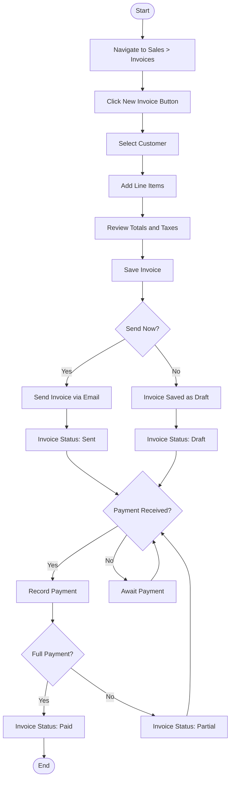
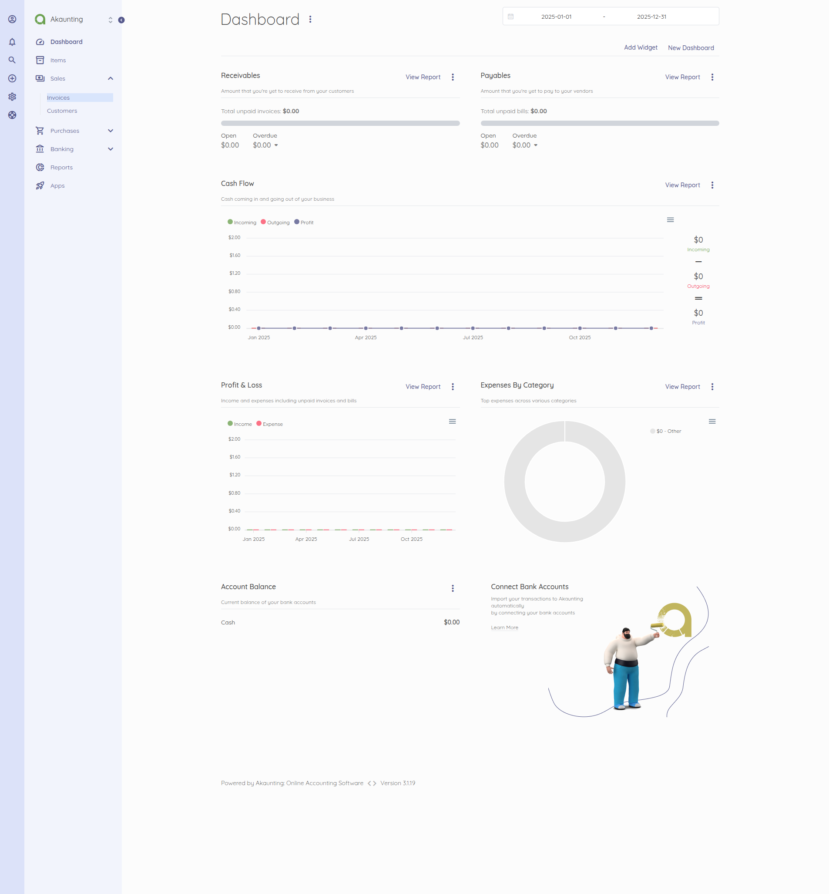
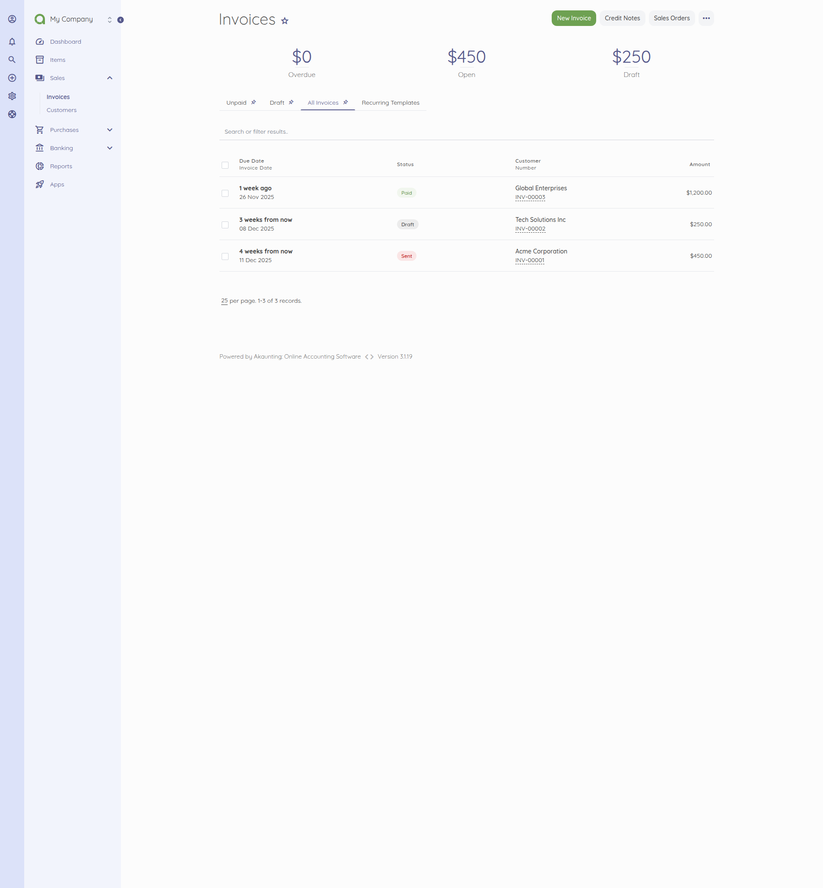
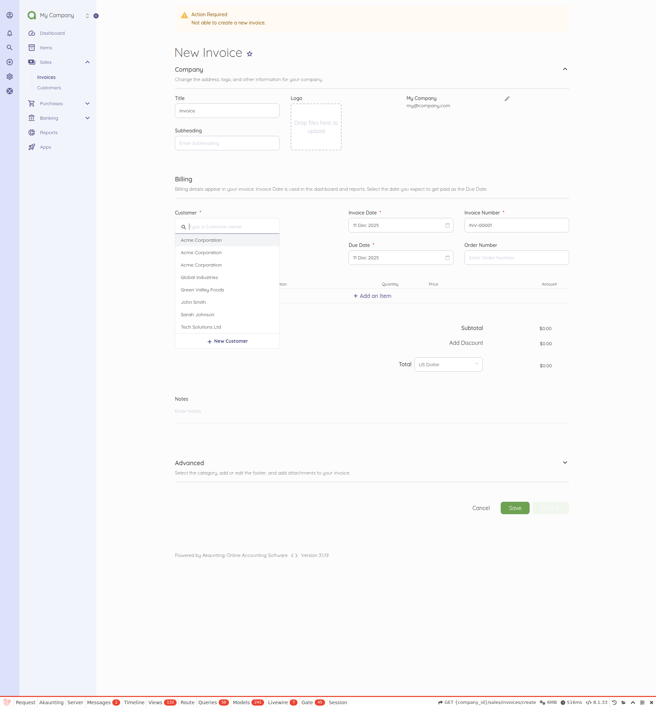
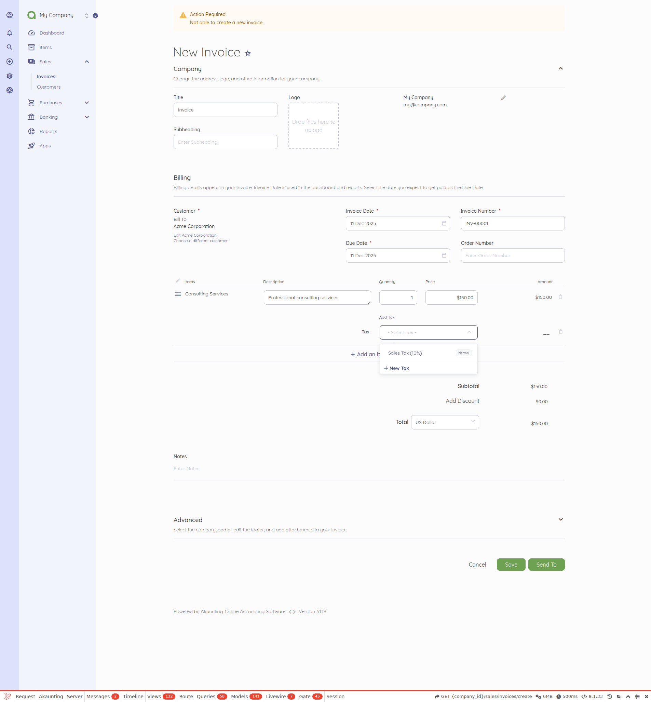
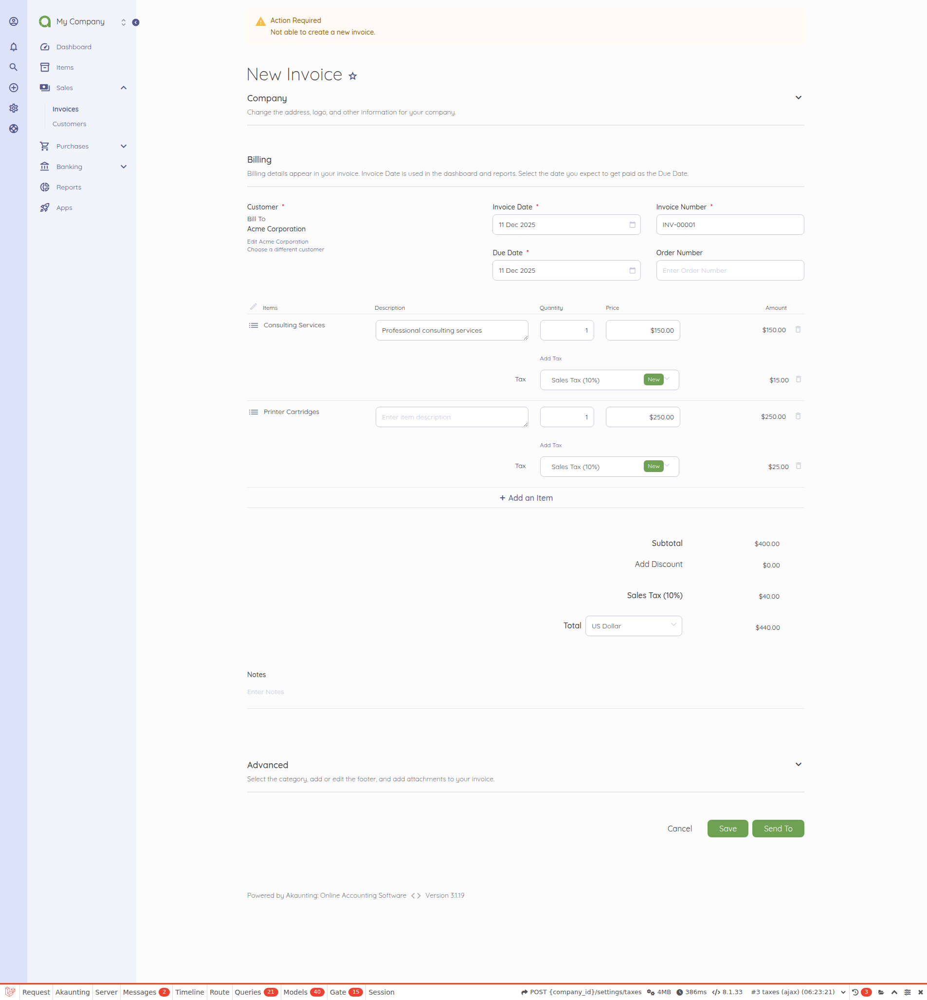
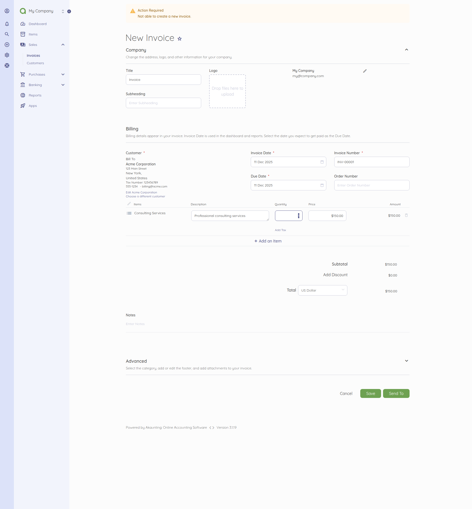
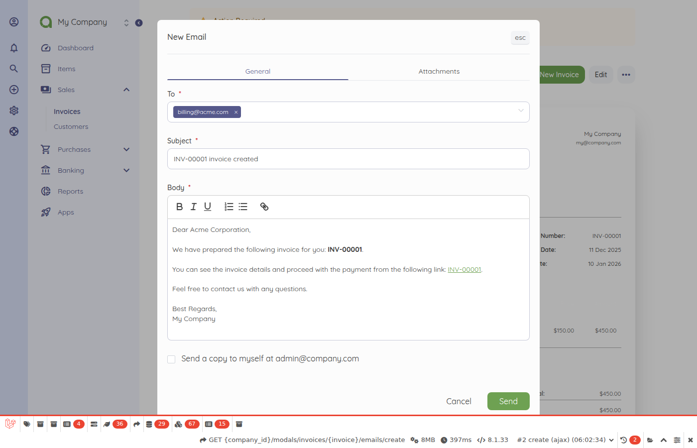
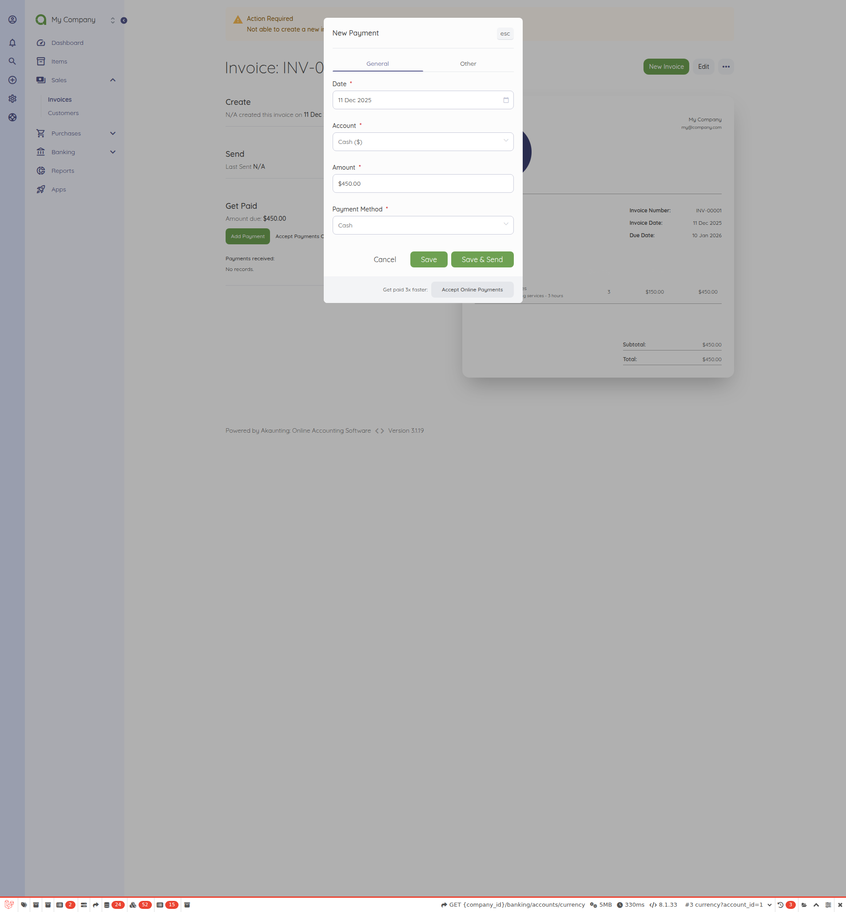

# Invoice Creation and Payment Workflow

<!-- Source: app/Http/Controllers/Sales/Invoices.php, app/Http/Controllers/Modals/DocumentTransactions.php -->

## Overview

The invoice creation and payment workflow enables businesses to generate revenue by billing customers for products and services and tracking payments received. This is a core daily operation used by business owners, accountants, and sales staff to manage accounts receivable.

## Prerequisites

Before creating an invoice, the user must have the following in place:

- **Customer Contact**: At least one customer must exist in the system (navigate to **Sales > Customers** to add a new customer)
- **Products/Services**: Items to be billed should be configured (navigate to **Items** to add products or services)
- **Tax Rates** (optional): If applicable, tax rates should be configured in **Settings > Taxes**
- **Bank Account**: A bank account should be configured in **Banking > Accounts** for recording payments

## Flow Diagram

The following diagram illustrates the complete invoice lifecycle from creation through payment:

### Status Transitions

| Current Status | Action | New Status |
|----------------|--------|------------|
| New | Save invoice | Draft |
| Draft | Send to customer | Sent |
| Draft/Sent | Record full payment | Paid |
| Draft/Sent | Record partial payment | Partial |
| Partial | Record remaining payment | Paid |
| Any | Cancel invoice | Cancelled |

## Step-by-Step Instructions

### Step 1: Navigate to the Invoice List

The user begins by accessing the invoice management area. From the main navigation sidebar, the user clicks on **Sales** to expand the menu, then selects **Invoices**. This opens the invoice list page showing all existing invoices with their status, customer name, amount, and due date.

### Step 2: Create a New Invoice

From the invoice list page, the user clicks the **New Invoice** button located in the top-right area of the page. This button may also appear as a "+" icon or "Add New" depending on the screen size. Clicking this button opens the invoice creation form where the user can enter all invoice details.

### Step 3: Select the Customer

On the invoice creation form, the user locates the **Customer** field, which is typically positioned at the top of the form. The user clicks on the dropdown and either scrolls through the list or types to search for the customer name. Once the correct customer is found, the user clicks to select them. The customer's billing address and contact information will automatically populate if configured.

### Step 4: Add Line Items

The user adds products or services to the invoice in the **Items** section. For each line item, the user selects an item from the dropdown (or types to search), then enters the **Quantity** and verifies the **Price**. The user can select applicable **Tax** rates for each item. To add additional items, the user clicks the **Add Item** button. The subtotal for each line calculates automatically based on quantity and price.

### Step 5: Review Totals and Taxes

Before saving, the user reviews the **Summary** section at the bottom of the form. This section displays the **Subtotal** (sum of all line items before tax), itemized **Tax** amounts for each applicable tax rate, any **Discounts** applied, and the **Grand Total** that the customer owes. The user verifies that all amounts are correct and match the expected billing.

### Step 6: Save the Invoice

After verifying all details, the user saves the invoice by clicking one of the save options at the bottom of the form. The **Save** button saves the invoice as a draft for later review. Alternatively, the **Save and Send** option saves the invoice and immediately proceeds to email it to the customer. A success message confirms that the invoice was created successfully.

### Step 7: Send the Invoice to the Customer

If the invoice was saved as a draft, the user can send it to the customer from the invoice detail page. The user clicks the **Send** or **Email** button in the action bar. A dialog may appear allowing the user to customize the email message before sending. Once sent, the invoice status changes from "Draft" to "Sent" and the customer receives an email with the invoice details and a link to view or pay online.

### Step 8: Record Payment

When payment is received from the customer, the user records it against the invoice. From the invoice detail page, the user clicks **Add Payment** or **Record Payment**. In the payment dialog, the user enters the **Amount** received (which defaults to the full balance due), selects the **Payment Date**, chooses the **Payment Method** (cash, bank transfer, check, etc.), and selects which **Bank Account** receives the funds. The user clicks **Save** to record the payment. If the full amount is paid, the invoice status changes to "Paid."

## Variations

### Recurring Invoices

For customers billed on a regular schedule (monthly retainers, subscriptions), the user can set up recurring invoices:

- When creating or editing an invoice, the user enables the **Recurring** toggle
- The user selects the frequency (weekly, monthly, quarterly, annually)
- The user sets the start date and optionally an end date
- The system automatically generates new invoices based on the schedule

### Partial Payments

If a customer pays only part of the invoice amount:

- The user records the partial payment amount (less than the total due)
- The invoice status changes to **Partial**
- The remaining balance is displayed on the invoice
- Additional payments can be recorded until the full amount is collected

### Discounts

To apply a discount to an invoice:

- **Line Item Discount**: Adjust the price on individual items
- **Total Discount**: Use the discount field in the totals section
- Discounts can be entered as a percentage or fixed amount
- The grand total automatically recalculates after applying discounts

### Multiple Tax Rates

For jurisdictions requiring multiple taxes (e.g., state and local taxes):

- Each line item can have one or more tax rates applied
- Compound taxes (tax on tax) can be configured in Settings if required
- The totals section shows each tax rate separately for transparency
- All tax amounts are calculated automatically based on the applicable rates

### Invoice Duplication

To create a similar invoice quickly:

- From any existing invoice, the user clicks **Duplicate**
- A new invoice is created with the same customer and line items
- The user adjusts dates, quantities, or other details as needed
- This is useful for repeat orders or similar billing scenarios

## Related Workflows

### Sales Capabilities
For a complete overview of all sales-related features including quotes, revenues, and customer management, see the [Capabilities Inventory](../../01-capabilities-overview/capabilities-inventory.md).

### Customer Portal
Customers can view their invoices and make payments through the self-service portal. When an invoice is sent, the email includes a link to the customer portal where they can:
- View invoice details and PDF
- Make online payments (if payment methods are configured)
- Access their payment history

### Quote to Invoice Conversion
If your business uses quotes before invoicing, quotes can be converted to invoices:
- Create and send a quote to the customer
- When the customer approves, convert the quote to an invoice
- All line items and customer details transfer automatically

## See Also

- [Validation Rules](../../04-business-rules/validation-rules.md) - Required fields and format requirements for invoices
- [Error Handling](../../04-business-rules/error-handling.md) - Common invoice errors and how to resolve them
- [Capabilities Inventory](../../01-capabilities-overview/capabilities-inventory.md) - Complete list of Sales module capabilities
