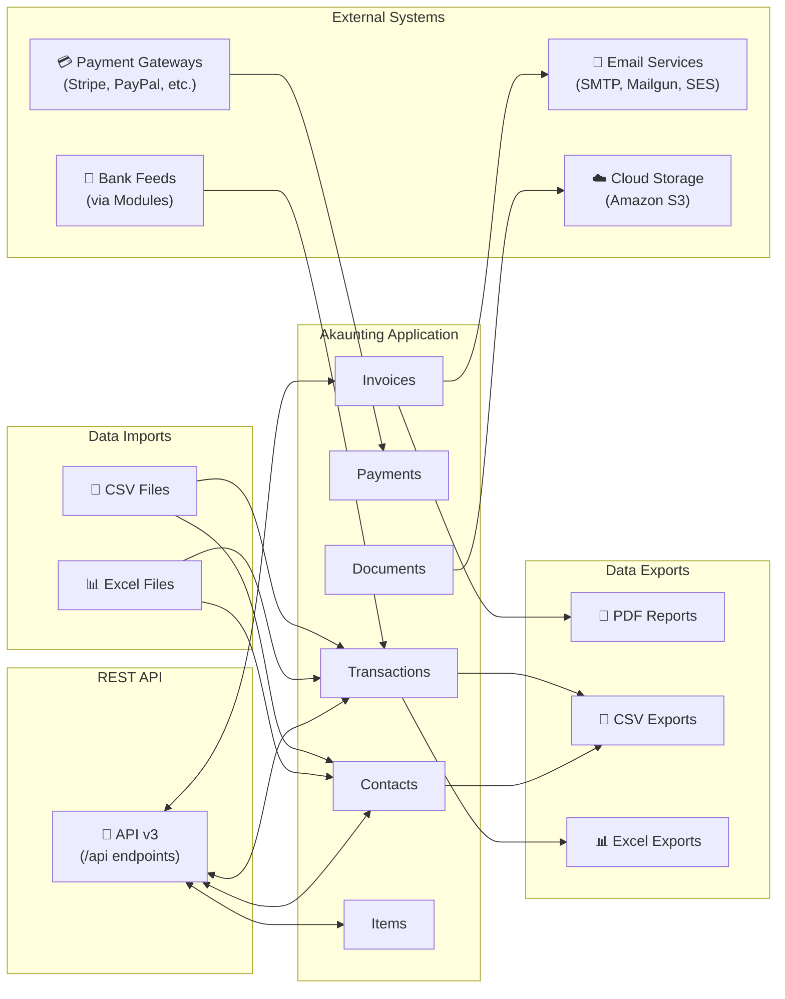

# Integration Map

<!-- Source: config/services.php, config/mail.php, config/filesystems.php, config/api.php, routes/api.php -->

## Overview

Akaunting connects with external systems and services to provide a complete accounting experience. This document provides a visual overview of all integration touchpoints, showing how data flows between Akaunting and external systems including payment processors, email services, cloud storage, and third-party applications.

The integration architecture supports:
- **Payment Processing** - Accept customer payments through various payment gateways
- **Email Delivery** - Send invoices, bills, and notifications via multiple email providers
- **Document Storage** - Store attachments locally or in cloud storage (Amazon S3)
- **Bank Synchronization** - Connect bank accounts to automatically import transactions
- **Data Exchange** - Import and export data via files (CSV, Excel) or REST API

---

## Visual Integration Diagram

The following diagram illustrates all external touchpoints and data flow directions:

---

## Payment Gateway Integrations

Akaunting processes customer payments through module-based payment gateway integrations. Payment processing is available through the Customer Portal, where customers can pay their invoices online.

| Aspect | Description |
|--------|-------------|
| **Architecture** | Module-based via Omnipay library |
| **Access Point** | Customer Portal invoice payment page |
| **Data Flow** | Customer initiates payment → Gateway processes → Transaction recorded in Akaunting |
| **Available Gateways** | Varies by installed modules (e.g., Stripe, PayPal, Authorize.Net) |

**Payment Flow:**
1. The customer receives an invoice via email with a payment link
2. The customer clicks the link to view the invoice in the Customer Portal
3. The customer selects a payment method and enters payment details
4. The payment gateway processes the transaction securely
5. Akaunting records the payment and updates the invoice status

> **Note:** Payment gateway availability depends on installed modules from the Akaunting App Store.

---

## Email Service Integrations

Akaunting sends transactional emails for invoices, bills, payment receipts, and system notifications. Multiple email delivery services are supported to ensure reliable message delivery.

| Service | Configuration | Best For |
|---------|--------------|----------|
| **SMTP** | Standard email server credentials | Organizations with existing email infrastructure |
| **Mailgun** | API domain and secret key | High-volume transactional email |
| **Amazon SES** | AWS access credentials | Cost-effective bulk sending |
| **Postmark** | API token | Fast delivery with detailed analytics |
| **SendGrid** | API key | Enterprise email delivery |
| **Sendmail** | Server path configuration | Local server environments |

**Email Types Sent:**
- **Invoice Notifications** - New invoice alerts, payment reminders, overdue notices
- **Bill Notifications** - New bill receipts sent to vendors
- **Payment Confirmations** - Receipt confirmations when payments are recorded
- **System Notifications** - Import/export completion alerts, user invitations

**Email Content Features:**
- Customizable email templates with dynamic placeholders
- PDF invoice/bill attachments
- Document attachments from stored files
- Branded company information (name, address, logo)

---

## Cloud Storage Integrations

Document attachments and generated files can be stored locally or in cloud storage for improved scalability and accessibility.

| Storage Option | Use Case | Configuration |
|----------------|----------|---------------|
| **Local Storage** | Single-server deployments, development environments | Default - no additional setup required |
| **Amazon S3** | Multi-server deployments, cloud hosting, disaster recovery | AWS credentials, bucket name, region |

**Supported File Types:**
- PDF documents
- JPEG and JPG images
- PNG images

**Storage Limits:**
- Maximum file size: 2 MB (configurable)
- Maximum image dimensions: 1000 x 1000 pixels (configurable)

**Storage Use Cases:**
- Invoice and bill PDF attachments
- Company logo and branding images
- Receipt and supporting document uploads
- Generated report archives

---

## Bank Feed Integrations

Akaunting supports bank account synchronization through module-based integrations. Bank feeds automatically import transactions from connected bank accounts, reducing manual data entry.

| Aspect | Description |
|--------|-------------|
| **Architecture** | Module-based (installed from App Store) |
| **Data Flow** | Bank → Akaunting (one-way import) |
| **Frequency** | Configurable automatic synchronization |
| **Transaction Types** | Deposits, withdrawals, transfers |

**Bank Feed Features:**
- Automatic transaction import from connected accounts
- Transaction categorization suggestions
- Duplicate detection to prevent re-importing existing transactions
- Reconciliation support with imported statement data

> **Note:** Bank feed functionality requires installation of a bank feed module compatible with your financial institution.

---

## API Integration Points

Akaunting provides a REST API (version 3) for programmatic access to all major entities. External applications can read and write data to integrate Akaunting with other business systems.

**API Configuration:**
| Setting | Value |
|---------|-------|
| **API Version** | v3 |
| **Base URL** | `{your-domain}/api` |
| **Content Type** | `application/vnd.akaunting.v3+json` |
| **Authentication** | API key or OAuth 2.0 |

**Available API Endpoints:**

| Endpoint | Operations | Description |
|----------|------------|-------------|
| `/api/users` | List, Create, Read, Update, Delete, Enable, Disable | User account management |
| `/api/companies` | List, Create, Read, Update, Delete, Enable, Disable | Multi-company management |
| `/api/items` | List, Create, Read, Update, Delete, Enable, Disable | Products and services catalog |
| `/api/contacts` | List, Create, Read, Update, Delete, Enable, Disable | Customers and vendors |
| `/api/documents` | List, Create, Read, Update, Delete | Invoices, bills, and other documents |
| `/api/documents/{id}/transactions` | List, Create, Read, Update, Delete | Document payments |
| `/api/accounts` | List, Create, Read, Update, Delete, Enable, Disable | Bank and cash accounts |
| `/api/transactions` | List, Create, Read, Update, Delete | Income and expense transactions |
| `/api/transfers` | List, Create, Read, Update, Delete | Transfer between accounts |
| `/api/reconciliations` | List, Create, Read, Update, Delete | Bank reconciliation records |
| `/api/categories` | List, Create, Read, Update, Delete, Enable, Disable | Income and expense categories |
| `/api/currencies` | List, Create, Read, Update, Delete, Enable, Disable | Currency configuration |
| `/api/taxes` | List, Create, Read, Update, Delete, Enable, Disable | Tax rate management |
| `/api/settings` | List, Create, Read, Update, Delete | Application settings |
| `/api/reports` | List, Read | Financial report data |
| `/api/dashboards` | List, Create, Read, Update, Delete, Enable, Disable | Dashboard configuration |

**API Use Cases:**
- Synchronize customer/vendor data from CRM systems
- Automate invoice creation from e-commerce platforms
- Export transaction data to external reporting tools
- Build custom dashboards and analytics
- Integrate with warehouse and inventory systems

---

## Data Import/Export Summary

Akaunting supports bulk data exchange through file imports and exports.

| Direction | Formats | Entities | Details |
|-----------|---------|----------|---------|
| **Inbound** | CSV, Excel (XLS, XLSX) | Contacts, Items, Transactions, Transfers, Invoices, Bills | See [Inbound Interfaces](inbound-interfaces.md) |
| **Outbound** | CSV, Excel (XLS, XLSX), PDF | Contacts, Items, Transactions, Transfers, Invoices, Bills, Reports | See [Outbound Interfaces](outbound-interfaces.md) |

---

## See Also

- [Inbound Interfaces](inbound-interfaces.md) - Detailed import specifications and file format requirements
- [Outbound Interfaces](outbound-interfaces.md) - Export capabilities and report generation details
- [Validation Rules](../04-business-rules/validation-rules.md) - Data validation applied during imports
