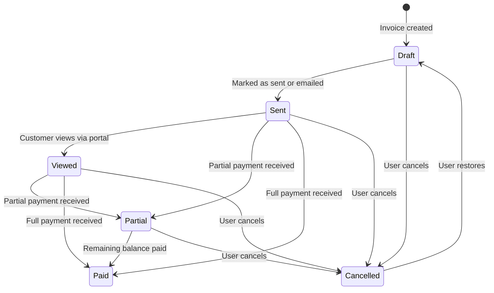
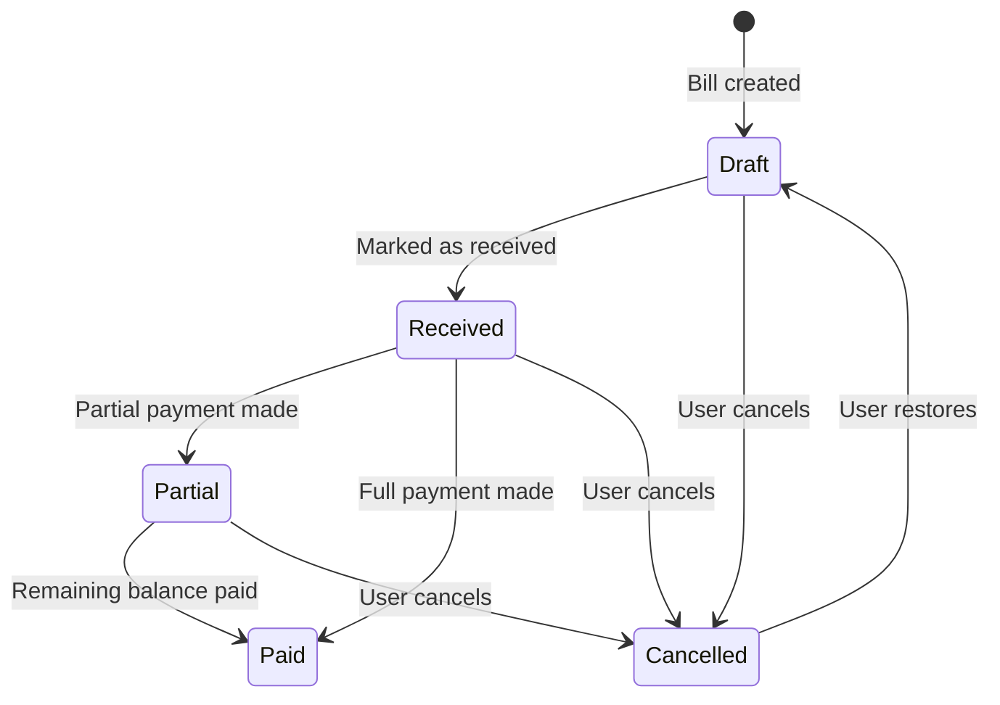
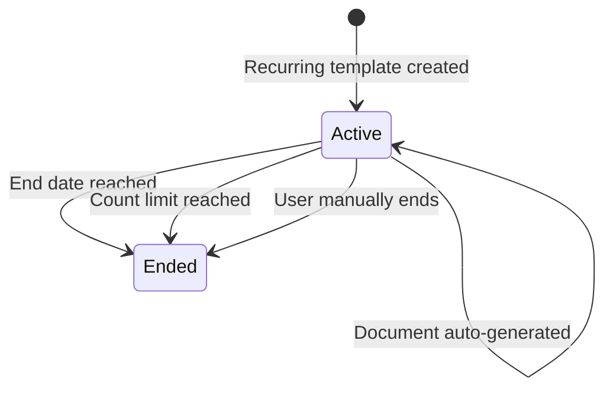

# Conditional Logic

<!-- Source: app/Http/Controllers/Sales/Invoices.php, app/Http/Controllers/Purchases/Bills.php, app/Models/Document/Document.php, app/Http/Requests/Document/Document.php, app/Http/Requests/Common/Item.php -->

## Overview

Akaunting applies business rules dynamically based on document type, current status, and user actions. These conditional behaviors control calculations, determine available actions, and manage how documents transition through their lifecycle.

---

## Document Calculations

<!-- Source: app/Models/Document/Document.php -->

Akaunting automatically calculates document totals as the user adds or modifies line items.

| Calculation | Formula | Description |
|-------------|---------|-------------|
| **Line Total** | Quantity × Unit Price | Each line item's total before any discounts |
| **Subtotal** | Sum of all Line Totals | Combined total of all line items |
| **Discount Amount** | Subtotal × (Discount Rate ÷ 100) | Discount applied as percentage of subtotal |
| **Tax Amount** | (Subtotal - Discount) × Tax Rate | Tax calculated on the discounted amount |
| **Grand Total** | Subtotal - Discount + Tax Amount | Final document total |

### Multi-Currency Calculations

When a document uses a currency different from the company's default:

- All amounts are stored in the document's currency
- The **currency rate** field tracks the exchange rate at the time of document creation
- Payments in different currencies are automatically converted using their respective rates
- Reports display converted amounts in the company's default currency

---

## Payment Conditions

<!-- Source: app/Models/Document/Document.php, resources/lang/en-GB/invoices.php, resources/lang/en-GB/messages.php -->

Payment recording follows specific rules that determine the resulting document status.

### Partial Payments

When a payment amount is **less than** the remaining balance:

- The payment is recorded against the document
- Document status changes to **Partial**
- The remaining balance is calculated automatically
- Additional payments can be added until the balance reaches zero

### Full Payments

When a payment amount **equals** the remaining balance:

- The payment is recorded against the document
- Document status changes to **Paid**
- No further payments can be added
- The document is marked as complete

### Overpayment Prevention

When a user attempts to enter a payment amount **greater than** the remaining balance:

- The system displays an error: **"The amount you entered passes the total: [amount]"**
- The payment is **not** recorded
- The user must enter an amount equal to or less than the outstanding balance

### Payment Amount Validation

| Condition | System Response |
|-----------|-----------------|
| Amount < Remaining Balance | Payment accepted; status changes to **Partial** |
| Amount = Remaining Balance | Payment accepted; status changes to **Paid** |
| Amount > Remaining Balance | Payment rejected with overpayment error |
| Amount = 0 or negative | Payment rejected with validation error |

---

## Status Transitions

<!-- Source: app/Http/Controllers/Sales/Invoices.php, app/Http/Controllers/Purchases/Bills.php, app/Models/Document/Document.php, resources/lang/en-GB/documents.php -->

Documents follow defined status workflows that determine available actions at each stage.

### Invoice Status Flow

**Invoice Status Descriptions:**

| Status | Meaning | Available Actions |
|--------|---------|-------------------|
| **Draft** | Invoice saved but not finalized | Edit, Send, Mark as Sent, Cancel, Delete |
| **Sent** | Invoice delivered to customer | Add Payment, View, Print, Email, Cancel |
| **Viewed** | Customer has viewed the invoice in portal | Add Payment, Print, Email, Cancel |
| **Partial** | Some payment has been received | Add Payment, Print, Cancel |
| **Paid** | Full amount has been received | Print, Duplicate |
| **Cancelled** | Invoice has been voided | Restore, Delete |

### Bill Status Flow

**Bill Status Descriptions:**

| Status | Meaning | Available Actions |
|--------|---------|-------------------|
| **Draft** | Bill saved but not finalized | Edit, Mark as Received, Cancel, Delete |
| **Received** | Bill acknowledged from vendor | Add Payment, Print, Cancel |
| **Partial** | Some payment has been made | Add Payment, Print, Cancel |
| **Paid** | Full amount has been paid | Print, Duplicate |
| **Cancelled** | Bill has been voided | Restore, Delete |

### Recurring Document Status

| Status | Meaning |
|--------|---------|
| **Active** | Recurring schedule is running and will generate new documents |
| **Ended** | Recurring schedule has stopped; no new documents will be generated |

---

## Recurring Schedule Logic

<!-- Source: app/Http/Requests/Document/Document.php -->

When a user enables recurring mode on a document, Akaunting automatically generates new instances based on the configured schedule.

### Frequency Options

| Frequency | Behavior |
|-----------|----------|
| **Daily** | New document created every day |
| **Weekly** | New document created every 7 days |
| **Monthly** | New document created on the same day each month |
| **Yearly** | New document created on the same day each year |
| **Custom** | User specifies interval count and base frequency |

### Custom Frequency Configuration

When **Custom** frequency is selected:

- The user must specify an **interval count** (e.g., "2")
- The user must specify a **base frequency** (daily, weekly, monthly, or yearly)
- Example: Interval of "2" with base "weekly" = every 2 weeks

### Limit Types

Recurring documents can be limited by:

| Limit Type | Configuration | Behavior |
|------------|---------------|----------|
| **By Date** | User specifies an end date | Schedule stops on or after the specified date |
| **By Count** | User specifies maximum occurrences | Schedule stops after the specified number of documents |
| **Unlimited** | No limit specified | Schedule continues indefinitely until manually ended |

### Auto-Generation Behavior

- New documents are created automatically at the scheduled time
- Each generated document receives a new, unique document number
- The document date is set based on the schedule
- Generated documents start in **Draft** status
- Users receive notifications when documents are auto-generated

---

## Feature Toggles

<!-- Source: app/Http/Requests/Common/Item.php, app/Http/Requests/Document/Document.php, resources/lang/en-GB/documents.php -->

Several features in Akaunting are conditionally enabled based on settings or user selections.

### Item Configuration Toggles

| Toggle | When Enabled | Effect |
|--------|--------------|--------|
| **Sale Information** | Checkbox selected during item creation | **Sale Price** field becomes required |
| **Purchase Information** | Checkbox selected during item creation | **Purchase Price** field becomes required |

**Note:** At least one of Sale Price or Purchase Price must be provided for any item. When neither toggle is explicitly set, the system requires at least one price value.

### Document Feature Toggles

| Toggle | When Enabled | Effect |
|--------|--------------|--------|
| **Accept Payments Online** | Enabled in document settings | Customers can pay invoices via integrated payment gateways through the customer portal |
| **Recurring Mode** | Frequency is specified on document | Recurring validation rules apply; schedule fields become required |

### Input Field Toggles

| Toggle | Condition | Effect |
|--------|-----------|--------|
| **Decimal Quantity** | Quantity field contains decimals (period or comma) | Field length increases from 10 to 12 characters maximum |
| **Decimal Price** | Price field contains decimals | Field length increases from 14 to 16 characters maximum |

---

## Dynamic Field Requirements

<!-- Source: app/Http/Requests/Document/Document.php, app/Http/Requests/Common/Item.php, app/Http/Requests/Banking/Account.php -->

Certain fields become required or change their validation rules based on other field values or system state.

| Condition | Fields Affected | Behavior |
|-----------|-----------------|----------|
| Custom recurring frequency selected | **recurring_interval**, **recurring_custom_frequency** | Both fields become required |
| Recurring limit type is "date" | **recurring_limit_date** | Must be a valid date on or after the start date |
| Recurring limit type is "count" | **recurring_limit_count** | Must be 0 or greater |
| Item has sale information enabled | **sale_price** | Becomes required; cannot be empty |
| Item has purchase information enabled | **purchase_price** | Becomes required; cannot be empty |
| Account type is "bank" | **opening_balance** | Must be a valid monetary amount |
| Document has no contact email | **Send Email** action | Disabled; user sees "No email address for this customer!" |
| Document has no totals calculated | **Add Payment** action | Disabled; user must save document with items first |

---

## Document Action Availability

<!-- Source: app/Models/Document/Document.php -->

Available actions change based on document status and state.

### When Actions Are Available

| Action | Availability Condition |
|--------|------------------------|
| **Edit** | Document is not reconciled (no reconciled transactions linked) |
| **Add Payment** | Status is not "Paid" or "Cancelled"; document has totals calculated |
| **Send Email** | Contact has an email address; status is not "Cancelled" |
| **Share Link** | Status is not "Cancelled" |
| **Cancel** | Status is not "Draft" and not already "Cancelled" |
| **Restore** | Status is "Cancelled" |
| **Delete** | Document is not a recurring template with active schedule |
| **End** | Recurring document with status not "Ended" |

### Reconciliation Lock

When a document has **reconciled transactions**:

- The document cannot be edited
- Related transactions cannot be modified or deleted
- A warning message appears: "You are not allowed to change/delete [type] because it has reconciled transactions!"

---

## Calculated Display Values

<!-- Source: app/Models/Document/Document.php -->

Akaunting calculates and displays several derived values to help users understand document status.

| Display Value | Calculation | Description |
|---------------|-------------|-------------|
| **Amount Due** | Grand Total - Total Paid | Remaining balance to be paid |
| **Paid Amount** | Sum of all payment transactions | Total amount received/paid |
| **Discount Percentage** | (Discount Amount ÷ Subtotal) × 100 | Percentage discount shown on document |
| **Amount Without Tax** | Grand Total - Sum of Tax Amounts | Document total excluding taxes |

---

## See Also

- [Validation Rules](validation-rules.md) - Field validation requirements and format specifications
- [Error Handling](error-handling.md) - User-facing error messages and resolution guidance
