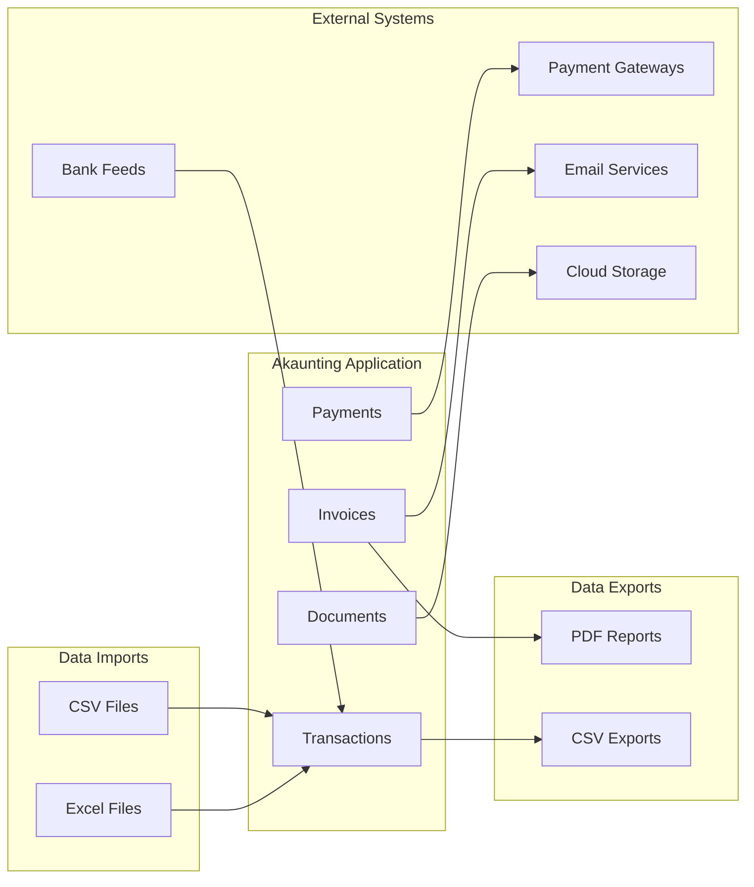

# Technical Specification

# 0. Agent Action Plan

## 0.1 Intent Clarification

### 0.1.1 Core Documentation Objective

Based on the provided requirements, the Blitzy platform understands that the documentation objective is to **generate comprehensive functional documentation for the Akaunting open-source accounting application**. This is categorized as **Creating new documentation** with a focus on business-oriented content.

**Documentation Type:** Business/Functional Documentation (NOT technical/developer documentation)

**Target Audience:** Product teams, business analysts, and stakeholders who need to understand Akaunting's capabilities for requirements writing, system migration, or rationalization efforts.

**Explicit Requirements:**

| Requirement ID | Requirement Description | Clarity Enhancement |
|----------------|------------------------|---------------------|
| REQ-001 | Document all business problems the application solves | Create capabilities inventory covering invoicing, expenses, banking, and reporting |
| REQ-002 | Document all major functional areas/modules | Map Invoicing, Bills, Banking, Reports, Dashboard, Items, Contacts, Settings |
| REQ-003 | Document user roles and permissions | Extract from Auth models (Permission, Role, User, UserCompany) |
| REQ-004 | Document business rules and validation logic | Extract from Form Requests and Controller validation |
| REQ-005 | Document integrations and external touchpoints | Cover payment gateways, bank feeds, and API integrations |
| REQ-006 | Document three critical user flows with screenshots | Identify, document, and capture actual UI screenshots |
| REQ-007 | Document inbound/outbound data interfaces | Cover imports (Excel/CSV), exports, and API data flows |
| REQ-008 | Document validation rules and error handling | Extract from Form Request classes and error response patterns |
| REQ-009 | Document conditional business logic | Extract from Controllers, Services, and Blade templates |

### 0.1.2 Special Instructions and Constraints

**CRITICAL DIRECTIVES FROM USER:**

- **Focus Constraint:** This is functional documentation ONLY - no code structure, classes, functions, or implementation details
- **Perspective:** Write from the user's perspective ("The user clicks..." not "The system processes...")
- **Language:** Clear, non-technical language appropriate for business analysts and product managers
- **Screenshot Requirement:** Spin up the Akaunting application and capture ACTUAL screenshots at each workflow step
- **Docker Setup:** Use `docker-compose up` to start the application; use `php artisan sample-data:seed` for test data
- **Conciseness:** Prioritize clarity over exhaustive detail - capabilities as one-sentence items, steps as 2-4 sentences maximum

**Length Constraints:**
| Document Type | Maximum Length |
|--------------|----------------|
| Capabilities inventory | ~2-4 pages |
| Individual flow document | ~3-5 pages (excluding screenshots) |
| Integration documents | ~1-2 pages each |
| Business rules documents | ~2-3 pages each |

**USER PROVIDED TEMPLATE (Folder Structure):**
```
/application-documentation
  /01-capabilities-overview
    capabilities-inventory.md
    user-roles-and-permissions.md
  /02-user-flows
    /[flow-1-name]
      flow-document.md
      /screenshots
        01-xxx.png
        02-xxx.png
    /[flow-2-name]
      flow-document.md
      /screenshots
    /[flow-3-name]
      flow-document.md
      /screenshots
  /03-integrations
    integration-map.md
    inbound-interfaces.md
    outbound-interfaces.md
  /04-business-rules
    validation-rules.md
    error-handling.md
    conditional-logic.md
```

### 0.1.3 Technical Interpretation

These documentation requirements translate to the following technical documentation strategy:

- **To document business capabilities**, we will analyze `app/Http/Controllers/`, `app/Models/`, and `routes/admin.php` to extract all user-facing functionality and create `01-capabilities-overview/capabilities-inventory.md`

- **To document user roles and permissions**, we will analyze `app/Models/Auth/Permission.php`, `app/Models/Auth/Role.php`, and policy files to create `01-capabilities-overview/user-roles-and-permissions.md`

- **To document critical user flows**, we will:
  1. Start the Akaunting Docker container
  2. Navigate through Invoice Creation, Bill Management, and Banking Reconciliation workflows
  3. Capture screenshots at each step
  4. Create flow documents with Mermaid diagrams in `02-user-flows/`

- **To document integrations**, we will analyze `config/services.php`, Omnipay implementations, and API routes to create `03-integrations/integration-map.md`, `inbound-interfaces.md`, and `outbound-interfaces.md`

- **To document business rules**, we will analyze Form Request classes in `app/Http/Requests/` and Controller validation logic to create `04-business-rules/validation-rules.md`, `error-handling.md`, and `conditional-logic.md`

### 0.1.4 Inferred Documentation Needs

Based on the codebase analysis and user requirements, the following implicit documentation needs have been identified:

**Based on code analysis:**
- Module: `app/Reports/` contains substantial financial reporting logic requiring documentation of available reports (Profit/Loss, Income Summary, Tax Summary, etc.)
- Module: `app/Jobs/` contains async processing that affects user experience (document import processing, PDF generation)
- Module: `app/Notifications/` contains user-facing notification events requiring documentation

**Based on structure:**
- Multi-company functionality spans multiple models requiring consolidated documentation in user roles section
- Currency handling (via `akaunting/laravel-money`) affects all financial workflows and needs mention

**Based on dependencies:**
- Payment gateway integrations (Omnipay) require specific workflow documentation
- Excel import/export (maatwebsite/excel) requires format specifications in integration docs

**Based on user journey:**
- Initial setup/wizard flow should be documented (new users need onboarding guidance)
- Portal access for customers is a distinct workflow requiring documentation
- Recurring invoices/bills are automated features requiring explanation


## 0.2 Documentation Discovery and Analysis

## 0.2 Documentation Discovery and Analysis

### 0.2.1 Existing Documentation Infrastructure Assessment

**Repository analysis reveals a minimal documentation structure with no existing functional documentation framework.**

**Search Patterns Employed:**
- `README*.md` - Found project overview only
- `docs/**` - No documentation directory exists
- `*.rst` - No reStructuredText files found
- `wiki/**` - No wiki directory
- `CONTRIBUTING.md` - Not present
- `CHANGELOG.md` - Not present

**Current Documentation Inventory:**

| File | Location | Content Type | Relevance to Task |
|------|----------|--------------|-------------------|
| README.md | Root | Project overview, tech stack, badges | LOW - marketing-focused, not functional |
| SECURITY.md | Root | Security vulnerability reporting | OUT OF SCOPE |
| .github/ISSUE_TEMPLATE.md | .github/ | Issue submission template | OUT OF SCOPE |
| .github/PULL_REQUEST_TEMPLATE.md | .github/ | PR submission template | OUT OF SCOPE |

**Documentation Generator Detection:**
- `mkdocs.yml` - NOT FOUND
- `docusaurus.config.js` - NOT FOUND  
- `sphinx/conf.py` - NOT FOUND
- `.readthedocs.yml` - NOT FOUND

**Conclusion:** No functional documentation exists. This is a greenfield documentation effort requiring complete creation of the `/application-documentation` structure.

**Current documentation framework:** None in use
**API documentation tools:** None detected (no JSDoc, PHPDoc generation config)
**Diagram tools detected:** None (Mermaid will be introduced per requirements)
**Documentation hosting/deployment:** Not configured

### 0.2.2 Repository Code Analysis for Documentation

**Search patterns used to identify code requiring functional documentation:**

| Pattern | Target | Files Found | Documentation Impact |
|---------|--------|-------------|---------------------|
| `app/Http/Controllers/**` | User-facing functionality | 50+ controllers | HIGH - Primary source for capabilities |
| `app/Models/**` | Business entities | 30+ models across domains | HIGH - Entity behavior documentation |
| `routes/admin.php` | Admin interface URLs | 1 file, ~200 routes | HIGH - URL-to-function mapping |
| `routes/portal.php` | Customer portal URLs | 1 file | MEDIUM - Portal capabilities |
| `app/Http/Requests/**` | Validation rules | 60+ request classes | HIGH - Business rules extraction |
| `app/Reports/**` | Financial reports | 6 report classes | HIGH - Reporting capabilities |
| `app/Imports/**` | Data import logic | 15+ import classes | MEDIUM - Inbound interface docs |
| `app/Exports/**` | Data export logic | 15+ export classes | MEDIUM - Outbound interface docs |

**Key Directories Examined:**

```
app/
├── Http/Controllers/
│   ├── Auth/           # User management, roles, permissions
│   ├── Banking/        # Accounts, transfers, reconciliation
│   ├── Common/         # Items, contacts, companies, dashboard
│   ├── Document/       # Invoices, bills, quotes, estimates
│   ├── Modules/        # App store, module management
│   ├── Portal/         # Customer-facing functionality
│   └── Settings/       # System configuration
├── Models/
│   ├── Auth/           # User, Role, Permission, UserCompany
│   ├── Banking/        # Account, Transaction, Transfer
│   ├── Common/         # Item, Contact, Company, Dashboard
│   ├── Document/       # Document, DocumentHistory, DocumentTotal
│   └── Setting/        # Category, Currency, Tax
└── Reports/
    ├── IncomeSummary.php
    ├── ExpenseSummary.php
    ├── IncomeExpenseSummary.php
    ├── ProfitLoss.php
    └── TaxSummary.php
```

**Related Documentation Found:** None - the application lacks functional documentation entirely.

### 0.2.3 Web Search Research Conducted

**Research Topic: Akaunting Docker Deployment**
- Official Docker repository exists at `akaunting/docker` (separate from main repo)
- Deployment command: `AKAUNTING_SETUP=true docker-compose up -d`
- Default port: 8080
- Setup wizard runs on first launch
- Sample data seeding available via `php artisan sample-data:seed`

**Research Topic: Accounting Software Functional Documentation Best Practices**
- User flows should be organized by business task (invoicing, purchasing, banking)
- Screenshots should show realistic data, not empty states
- Business rules should be presented as bullet points or tables, not paragraphs
- Integration documentation should focus on data direction and format

**Research Topic: Akaunting Application Features**
- Multi-company support (users can manage multiple businesses)
- Client portal (customers can view/pay invoices online)
- Modular architecture (App Store for extending functionality)
- Multi-currency support with live exchange rates
- Recurring transactions (invoices and bills)
- Bank account synchronization (via modules)
- Financial reporting (Profit/Loss, Income/Expense summaries)


## 0.3 Documentation Scope Analysis

## 0.3 Documentation Scope Analysis

### 0.3.1 Code-to-Documentation Mapping

**Modules Requiring Capabilities Documentation:**

| Module | Source Location | Public Capabilities | Documentation Needed |
|--------|-----------------|---------------------|---------------------|
| **Invoicing (Sales)** | `app/Http/Controllers/Sales/` | Create, send, pay, duplicate, export invoices | Capabilities inventory, user flow |
| **Bills (Purchases)** | `app/Http/Controllers/Purchases/` | Create, pay, duplicate, export bills | Capabilities inventory, user flow |
| **Banking** | `app/Http/Controllers/Banking/` | Manage accounts, record transfers, reconcile | Capabilities inventory, user flow |
| **Contacts** | `app/Http/Controllers/Common/Contacts.php` | Manage customers and vendors | Capabilities inventory |
| **Items** | `app/Http/Controllers/Common/Items.php` | Manage products and services | Capabilities inventory |
| **Reports** | `app/Http/Controllers/Common/Reports.php` | Generate financial reports | Capabilities inventory |
| **Dashboard** | `app/Http/Controllers/Common/Dashboards.php` | View financial summaries | Capabilities inventory |
| **Settings** | `app/Http/Controllers/Settings/` | Configure company, currencies, taxes, categories | Capabilities inventory |
| **User Management** | `app/Http/Controllers/Auth/` | Manage users, roles, permissions | User roles document |
| **Customer Portal** | `app/Http/Controllers/Portal/` | Customer invoice viewing/payment | Capabilities inventory |
| **Modules** | `app/Http/Controllers/Modules/` | App store, module installation | Capabilities inventory |

**Configuration Options Requiring Documentation:**

| Config Area | Source Location | Options | Documentation Status |
|-------------|-----------------|---------|---------------------|
| Company Settings | `app/Http/Controllers/Settings/Company.php` | Name, address, logo, currency | NEEDS DOCUMENTATION |
| Invoice Settings | `app/Http/Controllers/Settings/Invoice.php` | Numbering, prefix, terms | NEEDS DOCUMENTATION |
| Tax Settings | `app/Http/Controllers/Settings/Taxes.php` | Tax rates, compound taxes | NEEDS DOCUMENTATION |
| Currency Settings | `app/Http/Controllers/Settings/Currencies.php` | Currency codes, exchange rates | NEEDS DOCUMENTATION |
| Email Settings | `app/Http/Controllers/Settings/Email.php` | SMTP, templates | NEEDS DOCUMENTATION |
| Default Settings | `app/Http/Controllers/Settings/Defaults.php` | Default account, payment terms | NEEDS DOCUMENTATION |

**Features Requiring User Flow Documentation (Top 3 Critical):**

| Flow | Business Objective | Complexity | User Frequency | Selection Rationale |
|------|-------------------|------------|----------------|---------------------|
| **1. Invoice Creation & Payment** | Generate revenue, track receivables | HIGH (multi-step, attachments, payments) | DAILY | Core revenue operation |
| **2. Bill Recording & Payment** | Track expenses, manage payables | HIGH (multi-step, approvals, payments) | DAILY | Core expense operation |
| **3. Bank Reconciliation** | Ensure accurate financial records | MEDIUM (matching, importing) | WEEKLY | Compliance-critical |

### 0.3.2 Documentation Gap Analysis

**Given the requirements and repository analysis, documentation gaps include:**

**Undocumented Public Capabilities (Complete List):**

*Sales Module:*
- Invoice creation (draft, sent, paid, cancelled states)
- Invoice line item management
- Invoice PDF generation and download
- Invoice email sending
- Payment recording
- Recurring invoice setup
- Invoice duplication

*Purchases Module:*
- Bill creation and editing
- Bill payment recording
- Vendor payment tracking
- Recurring bill setup
- Bill approval workflow

*Banking Module:*
- Bank account management
- Manual transaction recording
- Bank transfer recording
- Transaction categorization
- Bank reconciliation workflow
- Bank statement import

*Contacts Module:*
- Customer creation and management
- Vendor creation and management
- Contact import/export

*Items Module:*
- Product/service creation
- Inventory tracking (if enabled)
- Item pricing and taxation

*Reports Module:*
- Income Summary report
- Expense Summary report
- Income vs Expense report
- Profit and Loss statement
- Tax Summary report

*Settings Module:*
- Company profile configuration
- Currency management
- Tax rate configuration
- Category management
- Invoice/bill template customization
- User management
- Role and permission assignment

*Portal Module:*
- Customer self-service invoice viewing
- Online payment processing
- Customer account management

**Missing User Guides:**
- Getting started / initial setup wizard
- Multi-company management
- Recurring transaction setup
- Report customization
- Module installation from App Store

**Incomplete Architecture Documentation:**
- Integration flow diagrams
- Data import/export specifications
- Payment gateway configuration

**Outdated Documentation:**
- Not applicable (no existing documentation to update)


## 0.4 Documentation Implementation Design

## 0.4 Documentation Implementation Design

### 0.4.1 Documentation Structure Planning

**Documentation Hierarchy:**

```
/application-documentation
├── README.md                              # Documentation index and navigation
├── 01-capabilities-overview/
│   ├── capabilities-inventory.md          # All business capabilities by functional area
│   └── user-roles-and-permissions.md      # Roles, permissions, access control
├── 02-user-flows/
│   ├── invoice-creation-and-payment/
│   │   ├── flow-document.md               # Complete invoice lifecycle flow
│   │   └── screenshots/
│   │       ├── 01-navigate-to-invoices.png
│   │       ├── 02-click-new-invoice.png
│   │       ├── 03-select-customer.png
│   │       ├── 04-add-line-items.png
│   │       ├── 05-review-totals.png
│   │       ├── 06-save-invoice.png
│   │       ├── 07-send-invoice.png
│   │       └── 08-record-payment.png
│   ├── bill-recording-and-payment/
│   │   ├── flow-document.md               # Complete bill lifecycle flow
│   │   └── screenshots/
│   │       ├── 01-navigate-to-bills.png
│   │       ├── 02-click-new-bill.png
│   │       ├── 03-select-vendor.png
│   │       ├── 04-add-line-items.png
│   │       ├── 05-save-bill.png
│   │       └── 06-record-payment.png
│   └── bank-reconciliation/
│       ├── flow-document.md               # Bank reconciliation workflow
│       └── screenshots/
│           ├── 01-navigate-to-banking.png
│           ├── 02-select-account.png
│           ├── 03-view-transactions.png
│           ├── 04-import-statement.png
│           └── 05-match-transactions.png
├── 03-integrations/
│   ├── integration-map.md                 # Visual diagram of all integration points
│   ├── inbound-interfaces.md              # Data imports, bank feeds, API inputs
│   └── outbound-interfaces.md             # Data exports, reports, notifications
└── 04-business-rules/
    ├── validation-rules.md                # Field and workflow validations
    ├── error-handling.md                  # User-facing error messages and resolutions
    └── conditional-logic.md               # Conditional behavior and calculations
```

### 0.4.2 Content Generation Strategy

**Information Extraction Approach:**

| Content Type | Source | Extraction Method |
|--------------|--------|-------------------|
| Capabilities list | `app/Http/Controllers/` | Analyze public methods, route definitions |
| User roles | `app/Models/Auth/Role.php`, `Permission.php` | Extract role names, permission assignments |
| Validation rules | `app/Http/Requests/**` | Parse `rules()` methods for field requirements |
| Error messages | `app/Http/Requests/**`, `resources/lang/` | Extract error message text |
| Workflow steps | Controllers + Blade templates | Trace user actions through codebase |
| Screenshots | Running application | Capture via Docker deployment |

**Template Application:**

Each documentation file will follow this structure:

```
# [Document Title]

#### Overview
[1-2 sentences describing purpose]

#### [Main Content Sections]
[Organized by logical groupings]

#### See Also
[Links to related documentation]
```

**Documentation Standards:**

- **Headers:** Use `#` for document title, `##` for major sections, `###` for subsections
- **Code examples:** Use triple backticks with language identifier (none for this project - functional docs)
- **Diagrams:** Use Mermaid syntax within fenced code blocks
- **Tables:** Use for structured data (capabilities, permissions, validation rules)
- **Lists:** Use bullet points for unordered items, numbered lists for sequential steps
- **Screenshots:** Reference inline as ``
- **Terminology:** Use accounting terms (invoice, bill, transaction) consistently

### 0.4.3 Diagram and Visual Strategy

**Mermaid Diagrams to Create:**

| Document | Diagram Type | Purpose |
|----------|--------------|---------|
| `integration-map.md` | Flowchart | Show data flow between Akaunting and external systems |
| `invoice-creation-and-payment/flow-document.md` | Flowchart | Invoice lifecycle from creation to payment |
| `bill-recording-and-payment/flow-document.md` | Flowchart | Bill lifecycle from recording to payment |
| `bank-reconciliation/flow-document.md` | Flowchart | Reconciliation workflow steps |
| `user-roles-and-permissions.md` | Flowchart | Role hierarchy and permission inheritance |

**Example Diagram (Integration Map):**



**Screenshot Requirements:**

| Flow | Screenshots Needed | Capture Points |
|------|-------------------|----------------|
| Invoice Creation | 8 images | Navigation, form entry, save, send, payment |
| Bill Recording | 6 images | Navigation, form entry, save, payment |
| Bank Reconciliation | 5 images | Navigation, account selection, import, matching |

**Screenshot Naming Convention:** `XX-descriptive-action-name.png` where XX is two-digit sequence number


## 0.5 Documentation File Transformation Mapping

## 0.5 Documentation File Transformation Mapping

### 0.5.1 File-by-File Documentation Plan

**CRITICAL: Complete mapping of EVERY documentation file to be created.**

| Target Documentation File | Transformation | Source Code/Docs | Content/Changes |
|---------------------------|----------------|------------------|-----------------|
| application-documentation/README.md | CREATE | N/A | Index page with navigation links to all documentation sections |
| application-documentation/01-capabilities-overview/capabilities-inventory.md | CREATE | app/Http/Controllers/**, routes/admin.php | Complete inventory of business capabilities organized by functional area (Sales, Purchases, Banking, Reports, Settings) |
| application-documentation/01-capabilities-overview/user-roles-and-permissions.md | CREATE | app/Models/Auth/Role.php, app/Models/Auth/Permission.php | User roles, permission matrix, access control documentation |
| application-documentation/02-user-flows/invoice-creation-and-payment/flow-document.md | CREATE | app/Http/Controllers/Sales/Invoices.php, resources/views/sales/invoices/** | Complete invoice workflow with prerequisites, Mermaid diagram, step-by-step instructions |
| application-documentation/02-user-flows/invoice-creation-and-payment/screenshots/*.png | CREATE | Running application | 8 screenshots capturing each step of invoice creation and payment |
| application-documentation/02-user-flows/bill-recording-and-payment/flow-document.md | CREATE | app/Http/Controllers/Purchases/Bills.php, resources/views/purchases/bills/** | Complete bill workflow with prerequisites, Mermaid diagram, step-by-step instructions |
| application-documentation/02-user-flows/bill-recording-and-payment/screenshots/*.png | CREATE | Running application | 6 screenshots capturing each step of bill recording and payment |
| application-documentation/02-user-flows/bank-reconciliation/flow-document.md | CREATE | app/Http/Controllers/Banking/**, resources/views/banking/** | Bank reconciliation workflow with Mermaid diagram and step-by-step instructions |
| application-documentation/02-user-flows/bank-reconciliation/screenshots/*.png | CREATE | Running application | 5 screenshots capturing reconciliation workflow |
| application-documentation/03-integrations/integration-map.md | CREATE | config/services.php, app/Jobs/**, routes/api.php | Visual Mermaid diagram showing all integration points with descriptions |
| application-documentation/03-integrations/inbound-interfaces.md | CREATE | app/Imports/**, app/Http/Controllers/Common/Imports.php | Import capabilities: file formats, data types, validation rules |
| application-documentation/03-integrations/outbound-interfaces.md | CREATE | app/Exports/**, app/Http/Controllers/Common/Reports.php | Export capabilities: report formats, data exports, notifications |
| application-documentation/04-business-rules/validation-rules.md | CREATE | app/Http/Requests/** | Field validations, required fields, format rules by entity type |
| application-documentation/04-business-rules/error-handling.md | CREATE | app/Http/Requests/**, resources/lang/en/** | User-facing error messages and resolution guidance |
| application-documentation/04-business-rules/conditional-logic.md | CREATE | app/Http/Controllers/**, Blade templates | Conditional behaviors, calculated fields, dynamic UI elements |

### 0.5.2 New Documentation Files Detail

**File: application-documentation/01-capabilities-overview/capabilities-inventory.md**
```
Type: Business Capabilities Reference
Source Code: app/Http/Controllers/**, routes/admin.php
Sections:
    - Overview (what Akaunting does)
    - Sales Capabilities (invoices, quotes, revenues, customers)
    - Purchases Capabilities (bills, expenses, payments, vendors)
    - Banking Capabilities (accounts, transfers, reconciliation, transactions)
    - Reporting Capabilities (financial reports, custom reports)
    - Settings Capabilities (company, currencies, taxes, categories)
    - Portal Capabilities (customer self-service)
    - Module Capabilities (app store, extensions)
Key Citations: routes/admin.php, app/Http/Controllers/
Target Length: 2-4 pages
```

**File: application-documentation/01-capabilities-overview/user-roles-and-permissions.md**
```
Type: Access Control Reference
Source Code: app/Models/Auth/Role.php, app/Models/Auth/Permission.php
Sections:
    - Overview (role-based access control)
    - Available Roles (Admin, Manager, User, Customer)
    - Permission Matrix (what each role can do)
    - Multi-Company Access (company-level permissions)
    - Approval Workflows (if applicable)
Diagrams:
    - Role hierarchy diagram
Key Citations: app/Models/Auth/Role.php, app/Models/Auth/Permission.php
Target Length: 1-2 pages
```

**File: application-documentation/02-user-flows/invoice-creation-and-payment/flow-document.md**
```
Type: User Flow Guide
Source Code: app/Http/Controllers/Sales/Invoices.php
Sections:
    - Overview (business objective: generate revenue)
    - Prerequisites (customer exists, items configured)
    - Flow Diagram (Mermaid flowchart)
    - Step-by-Step Breakdown:
        1. Navigate to Sales > Invoices
        2. Click "New Invoice" button
        3. Select customer
        4. Add line items
        5. Review totals and taxes
        6. Save as draft or send
        7. Send invoice via email
        8. Record payment when received
    - Variations (recurring invoices, partial payments)
    - Related Workflows (quote to invoice, customer portal)
Screenshots: 8 images
Key Citations: app/Http/Controllers/Sales/Invoices.php
Target Length: 3-5 pages
```

**File: application-documentation/02-user-flows/bill-recording-and-payment/flow-document.md**
```
Type: User Flow Guide
Source Code: app/Http/Controllers/Purchases/Bills.php
Sections:
    - Overview (business objective: track expenses)
    - Prerequisites (vendor exists, expense categories)
    - Flow Diagram (Mermaid flowchart)
    - Step-by-Step Breakdown:
        1. Navigate to Purchases > Bills
        2. Click "New Bill" button
        3. Select vendor
        4. Add line items
        5. Save bill
        6. Record payment when made
    - Variations (recurring bills, partial payments)
    - Related Workflows (expense tracking, vendor management)
Screenshots: 6 images
Key Citations: app/Http/Controllers/Purchases/Bills.php
Target Length: 3-5 pages
```

**File: application-documentation/02-user-flows/bank-reconciliation/flow-document.md**
```
Type: User Flow Guide
Source Code: app/Http/Controllers/Banking/Reconciliations.php
Sections:
    - Overview (business objective: accurate records)
    - Prerequisites (bank account configured)
    - Flow Diagram (Mermaid flowchart)
    - Step-by-Step Breakdown:
        1. Navigate to Banking > Accounts
        2. Select bank account
        3. View unreconciled transactions
        4. Import bank statement (optional)
        5. Match/reconcile transactions
    - Variations (manual entry, automatic matching)
    - Related Workflows (transaction categorization)
Screenshots: 5 images
Key Citations: app/Http/Controllers/Banking/Reconciliations.php
Target Length: 3-5 pages
```

**File: application-documentation/03-integrations/integration-map.md**
```
Type: Integration Reference
Source Code: config/services.php, routes/api.php
Sections:
    - Overview (integration architecture)
    - Visual Integration Diagram (Mermaid)
    - Payment Gateway Integrations (Omnipay)
    - Email Service Integrations
    - Cloud Storage Integrations
    - API Integration Points
Diagrams:
    - System integration flowchart
Key Citations: config/services.php, app/Jobs/**
Target Length: 1-2 pages
```

**File: application-documentation/03-integrations/inbound-interfaces.md**
```
Type: Integration Reference
Source Code: app/Imports/**
Sections:
    - Overview (what can be imported)
    - Supported Import Types (contacts, items, transactions)
    - File Format Specifications (CSV columns, Excel templates)
    - Validation Rules (what happens on import errors)
    - Bank Feed Integrations (via modules)
Key Citations: app/Imports/**
Target Length: 1-2 pages
```

**File: application-documentation/03-integrations/outbound-interfaces.md**
```
Type: Integration Reference
Source Code: app/Exports/**, app/Reports/**
Sections:
    - Overview (what can be exported)
    - Data Export Formats (CSV, Excel)
    - Report Formats (PDF, print)
    - Automated Notifications (email alerts)
    - API Data Access
Key Citations: app/Exports/**, app/Reports/**
Target Length: 1-2 pages
```

**File: application-documentation/04-business-rules/validation-rules.md**
```
Type: Business Rules Reference
Source Code: app/Http/Requests/**
Sections:
    - Overview (validation approach)
    - Invoice Validation Rules
    - Bill Validation Rules
    - Contact Validation Rules
    - Item Validation Rules
    - Transaction Validation Rules
    - Cross-Field Validations
Format: Tables with Field, Required, Format, Constraints
Key Citations: app/Http/Requests/**
Target Length: 2-3 pages
```

**File: application-documentation/04-business-rules/error-handling.md**
```
Type: Business Rules Reference
Source Code: app/Http/Requests/**, resources/lang/en/**
Sections:
    - Overview (how errors are presented)
    - Validation Errors (field-level messages)
    - Business Rule Errors (workflow violations)
    - System Errors (connection issues)
    - Error Resolution Guide
Format: Error message, cause, resolution
Key Citations: resources/lang/en/validation.php
Target Length: 2-3 pages
```

**File: application-documentation/04-business-rules/conditional-logic.md**
```
Type: Business Rules Reference
Source Code: app/Http/Controllers/**, Blade templates
Sections:
    - Overview (dynamic behavior)
    - Invoice Calculations (tax, totals, discounts)
    - Payment Conditions (partial payments, overpayments)
    - Status Transitions (draft to sent to paid)
    - Feature Toggles (settings-based behavior)
    - Derived Values (calculated fields)
Key Citations: app/Http/Controllers/**
Target Length: 2-3 pages
```

### 0.5.3 Cross-Documentation Dependencies

**Navigation Links Required:**

| From Document | To Document | Link Text |
|---------------|-------------|-----------|
| capabilities-inventory.md | invoice-creation-and-payment/flow-document.md | "See Invoice Creation Flow" |
| capabilities-inventory.md | bill-recording-and-payment/flow-document.md | "See Bill Recording Flow" |
| capabilities-inventory.md | bank-reconciliation/flow-document.md | "See Bank Reconciliation Flow" |
| user-roles-and-permissions.md | capabilities-inventory.md | "See Capabilities Inventory" |
| flow-document.md (each) | validation-rules.md | "See Validation Rules" |
| flow-document.md (each) | error-handling.md | "See Error Handling" |
| integration-map.md | inbound-interfaces.md | "See Inbound Interfaces" |
| integration-map.md | outbound-interfaces.md | "See Outbound Interfaces" |

**Index/Navigation Updates:**
- `application-documentation/README.md` must include links to all 10 documentation files
- Each flow document must reference related capabilities and business rules


## 0.6 Dependency Inventory

## 0.6 Dependency Inventory

### 0.6.1 Documentation Dependencies

**Documentation Tools and Packages Required:**

| Registry | Package Name | Version | Purpose |
|----------|--------------|---------|---------|
| npm | mermaid | 10.6.1 | Render flow diagrams in Markdown viewers |
| docker | akaunting/akaunting | latest | Run application for screenshot capture |
| docker | mysql | 8.0 | Database for Akaunting application |
| system | screenshot tool | native | Capture UI screenshots (browser dev tools or puppeteer) |

**Application Runtime Dependencies (for screenshot capture):**

| Dependency | Source | Version | Purpose |
|------------|--------|---------|---------|
| PHP | composer.json | ^8.1 | Laravel runtime |
| Laravel | composer.json | ^10.0 | Application framework |
| Node.js | package.json | >=16 | Asset compilation |
| MySQL/MariaDB | Docker | 8.0 | Database backend |

**Docker Images Required:**

| Image | Version | Purpose |
|-------|---------|---------|
| akaunting/akaunting | latest | Main application container |
| mysql | 8.0 | Database container |
| nginx | alpine | Reverse proxy (if using FPM setup) |

### 0.6.2 Application Setup for Screenshot Capture

**Docker Deployment Steps:**

```bash
# Clone the Docker repository
git clone https://github.com/akaunting/docker
cd docker

#### Configure environment files
cp env/db.env.example env/db.env
cp env/run.env.example env/run.env

#### Start containers with setup mode
AKAUNTING_SETUP=true docker-compose up -d

#### Access at http://localhost:8080 and complete wizard
#### After setup, restart without AKAUNTING_SETUP
docker-compose down
docker-compose up -d

#### Seed sample data for realistic screenshots
docker-compose exec akaunting php artisan sample-data:seed
```

**Artisan Commands for Sample Data:**

| Command | Purpose |
|---------|---------|
| `php artisan sample-data:seed` | Populate database with realistic sample data |
| `php artisan cache:clear` | Clear application cache if needed |
| `php artisan view:clear` | Clear compiled views if UI issues |

### 0.6.3 Markdown Rendering Requirements

**Mermaid Diagram Rendering:**

Documentation files use Mermaid diagrams which require a compatible viewer:
- GitHub renders Mermaid natively in Markdown
- VS Code requires "Markdown Preview Mermaid Support" extension
- Static site generators (MkDocs, Docusaurus) need Mermaid plugins

**Recommended Viewers:**
| Viewer | Mermaid Support |
|--------|-----------------|
| GitHub | Native |
| GitLab | Native |
| VS Code | Extension required |
| Obsidian | Native |
| MkDocs | Plugin: `mkdocs-mermaid2-plugin` |


## 0.7 Coverage and Quality Targets

## 0.7 Coverage and Quality Targets

### 0.7.1 Documentation Coverage Metrics

**Current Coverage Analysis:**

| Coverage Area | Current | Target | Gap |
|---------------|---------|--------|-----|
| Public capabilities documented | 0% | 100% | All functional areas |
| User flows documented | 0% | 3 critical flows | Invoice, Bill, Reconciliation |
| Integration points documented | 0% | 100% | All external touchpoints |
| Business rules documented | 0% | 100% | All validation and conditional logic |
| User roles documented | 0% | 100% | All roles and permissions |

**Target Coverage by Functional Area:**

| Functional Area | Capabilities to Document | Target Coverage |
|-----------------|-------------------------|-----------------|
| Sales (Invoicing) | 8 capabilities | 100% |
| Purchases (Bills) | 6 capabilities | 100% |
| Banking | 6 capabilities | 100% |
| Contacts | 4 capabilities | 100% |
| Items | 3 capabilities | 100% |
| Reports | 5 report types | 100% |
| Settings | 8 configuration areas | 100% |
| Portal | 3 capabilities | 100% |
| Modules | 2 capabilities | 100% |

### 0.7.2 Documentation Quality Criteria

**Completeness Requirements:**

| Document Type | Required Elements |
|---------------|-------------------|
| Capabilities Inventory | One-sentence description per capability, organized by area |
| User Roles | Role names, permission list, access matrix |
| User Flows | Overview, prerequisites, Mermaid diagram, numbered steps, screenshots, variations |
| Integration Docs | Diagram, data direction, formats supported |
| Business Rules | Field name, requirement, format, constraints |

**Accuracy Validation:**

| Validation Type | Method |
|-----------------|--------|
| Screenshot accuracy | Must match current application UI (version 3.1.15) |
| Workflow accuracy | Steps must be verified by actual walkthrough |
| Capability accuracy | Must reflect features visible in admin interface |
| Validation rules | Must match actual Form Request definitions |

**Clarity Standards:**

| Standard | Implementation |
|----------|----------------|
| Non-technical language | Avoid code references, use business terms |
| User perspective | "The user clicks..." not "The system processes..." |
| Consistent terminology | Use glossary terms throughout |
| Progressive disclosure | Simple overview → detailed steps |

**Maintainability Requirements:**

| Requirement | Implementation |
|-------------|----------------|
| Source citations | Reference source files in document comments |
| Version tracking | Note Akaunting version (3.1.15) in documents |
| Modular structure | Each capability/flow in logical sections |
| Update-friendly format | Tables and lists over prose paragraphs |

### 0.7.3 Example and Diagram Requirements

**Screenshot Requirements:**

| Flow | Minimum Screenshots | Key Capture Points |
|------|--------------------|--------------------|
| Invoice Creation | 8 | Form states, validation messages, confirmation |
| Bill Recording | 6 | Form states, payment recording |
| Bank Reconciliation | 5 | Account list, transaction matching |

**Screenshot Quality Criteria:**
- Full viewport capture (not cropped)
- Realistic sample data visible
- No browser chrome unless contextually important
- PNG format, reasonable resolution
- Sequential numbering (01-, 02-, etc.)

**Diagram Requirements:**

| Document | Required Diagrams |
|----------|-------------------|
| Each user flow | 1 Mermaid flowchart showing decision points |
| Integration map | 1 Mermaid flowchart showing data flows |
| User roles | 1 Mermaid diagram showing role hierarchy (optional) |

**Diagram Quality Criteria:**
- Mermaid syntax validated
- Clear node labels
- Logical flow direction (LR or TD)
- Color coding for external vs internal systems


## 0.8 Scope Boundaries

## 0.8 Scope Boundaries

### 0.8.1 Exhaustively In Scope

**New Documentation Files (CREATE):**

| Path Pattern | Description |
|--------------|-------------|
| `application-documentation/README.md` | Navigation index |
| `application-documentation/01-capabilities-overview/*.md` | All capability documentation |
| `application-documentation/02-user-flows/**/*.md` | All user flow documents |
| `application-documentation/02-user-flows/**/screenshots/*.png` | All workflow screenshots |
| `application-documentation/03-integrations/*.md` | All integration documentation |
| `application-documentation/04-business-rules/*.md` | All business rules documentation |

**Documentation Content Types:**

| Content Type | Status |
|--------------|--------|
| Business capabilities by functional area | IN SCOPE |
| User role definitions and permissions | IN SCOPE |
| Step-by-step user workflow guides | IN SCOPE |
| UI screenshots with sample data | IN SCOPE |
| Mermaid workflow diagrams | IN SCOPE |
| Integration architecture diagrams | IN SCOPE |
| Data import/export specifications | IN SCOPE |
| Field validation rules | IN SCOPE |
| Error message documentation | IN SCOPE |
| Conditional business logic | IN SCOPE |

**Source Files for Analysis (READ ONLY):**

| Path Pattern | Purpose |
|--------------|---------|
| `app/Http/Controllers/**` | Extract capabilities and workflows |
| `app/Models/**` | Understand business entities |
| `app/Http/Requests/**` | Extract validation rules |
| `app/Reports/**` | Document reporting capabilities |
| `app/Imports/**` | Document inbound interfaces |
| `app/Exports/**` | Document outbound interfaces |
| `routes/admin.php` | Map URL structure to functions |
| `routes/portal.php` | Document portal capabilities |
| `resources/views/**` | Understand UI layouts |
| `resources/lang/en/**` | Extract error messages |
| `config/services.php` | Document integrations |

### 0.8.2 Explicitly Out of Scope

**Documentation NOT to Create:**

| Exclusion | Reason |
|-----------|--------|
| API endpoint documentation | Technical/developer documentation |
| Database schema documentation | Technical/developer documentation |
| Code architecture documentation | Technical/developer documentation |
| Installation/setup guides | Technical/developer documentation |
| Developer contribution guides | Technical/developer documentation |
| Test documentation | Technical/developer documentation |
| Security implementation docs | Technical/developer documentation |
| Performance tuning guides | Technical/developer documentation |

**Source Code Modifications:**

| Exclusion | Reason |
|-----------|--------|
| Adding docblocks/comments | Out of scope per user instructions |
| Modifying PHP files | Out of scope per user instructions |
| Modifying JavaScript files | Out of scope per user instructions |
| Modifying configuration files | Out of scope per user instructions |
| Creating test files | Out of scope per user instructions |

**Content Restrictions:**

| Restriction | Implementation |
|-------------|----------------|
| No code snippets | Documentation is for business users |
| No class diagrams | Technical artifact, not business-focused |
| No database models | Technical artifact, not business-focused |
| No API contracts | Technical artifact, not business-focused |
| No CLI commands | Technical artifact (except for setup instructions in dependency section) |

**Explicitly Excluded by User Instructions:**

- Code structure, classes, functions, or implementation details
- Database schema or data models
- API endpoints or technical contracts
- Developer setup instructions
- Technical architecture or design patterns
- Performance characteristics or optimization
- Security implementation details
- Test coverage or testing approaches

### 0.8.3 Boundary Clarifications

**Gray Areas Resolved:**

| Item | Decision | Rationale |
|------|----------|-----------|
| Accounting terminology | IN SCOPE | Domain-specific, acceptable per instructions |
| Module/App Store features | IN SCOPE | User-facing capability |
| Multi-company feature | IN SCOPE | User-facing capability |
| Currency/tax calculations | IN SCOPE | Business logic from user perspective |
| Email notification content | IN SCOPE | User-facing behavior |
| PDF report layouts | IN SCOPE | User-facing output |
| Import file format specs | IN SCOPE | User needs to know formats |
| Error message text | IN SCOPE | User-facing experience |


## 0.9 Execution Parameters

## 0.9 Execution Parameters

### 0.9.1 Documentation-Specific Instructions

**Application Startup Commands:**

```bash
# Clone Docker configuration
git clone https://github.com/akaunting/docker
cd docker

#### Initialize environment
cp env/db.env.example env/db.env
cp env/run.env.example env/run.env

#### Start application in setup mode
AKAUNTING_SETUP=true docker-compose up -d

#### Wait for initialization, then access http://localhost:8080
#### Complete the setup wizard

#### Restart in normal mode
docker-compose down
docker-compose up -d

#### Seed sample data for screenshots
docker-compose exec akaunting php artisan sample-data:seed
```

**Screenshot Capture Method:**

| Method | Command/Tool | Notes |
|--------|--------------|-------|
| Browser DevTools | F12 → Device Toggle → Capture | Best for full-page captures |
| Puppeteer/Playwright | Automated script | Consistent captures |
| OS Screenshot | PrintScreen / Cmd+Shift+4 | Manual method |

**Default Documentation Format:**
- **Format:** Markdown (.md files)
- **Diagrams:** Mermaid (embedded in Markdown)
- **Images:** PNG format
- **Tables:** Markdown pipe tables
- **Lists:** Markdown bullets and numbers

**Citation Requirement:**
Every section should reference its source in HTML comments:

```
<!-- Source: app/Http/Controllers/Sales/Invoices.php -->
## Invoice Capabilities
...
```

**Style Guide:**
- Use present tense ("The user clicks..." not "The user will click...")
- Use active voice ("Click the Save button" not "The Save button should be clicked")
- One sentence per capability in inventory
- 2-4 sentences per workflow step
- Tables for structured data (validations, permissions)
- Bullet points for lists of capabilities

### 0.9.2 Documentation Validation Checklist

**Pre-Delivery Validation:**

| Check | Validation Method |
|-------|-------------------|
| Markdown syntax | Render in GitHub/VS Code preview |
| Mermaid diagrams | Validate in Mermaid Live Editor |
| Internal links | Manual verification |
| Screenshot references | Verify file exists |
| Completeness | All 10 files present |
| Length compliance | Each doc within page limits |

**Screenshot Validation:**

| Check | Criteria |
|-------|----------|
| Application version | Must show Akaunting 3.1.15 |
| Sample data | Realistic data visible, not empty states |
| UI state | Captures meaningful workflow step |
| File format | PNG format |
| Naming | Sequential numbering (01-, 02-, etc.) |

### 0.9.3 Folder Creation Commands

**Initialize Documentation Structure:**

```bash
# Create documentation folder structure
mkdir -p application-documentation/01-capabilities-overview
mkdir -p application-documentation/02-user-flows/invoice-creation-and-payment/screenshots
mkdir -p application-documentation/02-user-flows/bill-recording-and-payment/screenshots
mkdir -p application-documentation/02-user-flows/bank-reconciliation/screenshots
mkdir -p application-documentation/03-integrations
mkdir -p application-documentation/04-business-rules
```

**File Creation Order:**

| Order | File | Dependencies |
|-------|------|--------------|
| 1 | README.md | None |
| 2 | capabilities-inventory.md | Code analysis complete |
| 3 | user-roles-and-permissions.md | Code analysis complete |
| 4 | invoice-creation-and-payment/flow-document.md | Screenshots captured |
| 5 | bill-recording-and-payment/flow-document.md | Screenshots captured |
| 6 | bank-reconciliation/flow-document.md | Screenshots captured |
| 7 | integration-map.md | Code analysis complete |
| 8 | inbound-interfaces.md | Code analysis complete |
| 9 | outbound-interfaces.md | Code analysis complete |
| 10 | validation-rules.md | Code analysis complete |
| 11 | error-handling.md | Code analysis complete |
| 12 | conditional-logic.md | Code analysis complete |


## 0.10 Special Instructions for Documentation

## 0.10 Special Instructions for Documentation

### 0.10.1 User-Specified Directives

The following special instructions were explicitly emphasized by the user and must be strictly observed:

**Content Focus Constraints:**

| Directive | Implementation |
|-----------|----------------|
| "This is NOT technical/developer documentation" | No code structure, classes, functions, or implementation details |
| "Focus exclusively on business capabilities, user workflows, and functional behavior" | Document what users can accomplish, not how the system implements it |
| "Write from the user's perspective" | Use "The user clicks..." not "The system processes..." |
| "Clear, non-technical language appropriate for business analysts" | Avoid jargon; explain accounting terms if needed |

**Screenshot Requirements:**

| Directive | Implementation |
|-----------|----------------|
| "Spin up the Akaunting web application" | Use Docker deployment from akaunting/docker repository |
| "Capture actual screenshots" | Real UI captures, not mockups |
| "Show realistic sample data" | Run `php artisan sample-data:seed` before captures |
| "Not empty states unless documenting empty states" | Populate data before screenshots |
| "Full application viewport" | No cropped partial views |
| "Sequential numbering: 01-xxx.png, 02-xxx.png" | Strict naming convention |

**Length and Conciseness:**

| Directive | Implementation |
|-----------|----------------|
| "Prioritize clarity and completeness over exhaustive detail" | Be concise but complete |
| "One sentence per capability" | No elaboration unless needed for clarity |
| "Each step description 2-4 sentences maximum" | Let screenshots do the heavy lifting |
| "Document rules as concise bullet points, not paragraphs" | Use tables where appropriate |
| "Focus on what data moves and in what direction" | No speculation about implementation |
| "When in doubt, be brief" | Reader can ask follow-up questions |

**Quality Completion Criteria:**

| Criterion | Validation |
|-----------|------------|
| "All major functional areas of Akaunting are inventoried" | Sales, Purchases, Banking, Reports, Settings, Portal, Modules covered |
| "Three critical user flows are fully documented with screenshots at each step" | Invoice, Bill, Reconciliation flows complete |
| "All screenshots show actual application UI with realistic data" | Verified against running application |
| "Documentation could be understood by a business analyst with no technical background" | No code references |
| "A product team could use this documentation to write functional requirements" | Actionable, complete capability descriptions |

### 0.10.2 Style and Format Rules

**Terminology Standards:**

| Term | Usage |
|------|-------|
| Invoice | Use for customer-facing sales documents |
| Bill | Use for vendor-facing purchase documents |
| Customer | Use for entities you sell to |
| Vendor | Use for entities you buy from |
| Transaction | Use for bank account activity |
| Item | Use for products or services |
| Account | Use for bank/financial accounts |

**Markdown Conventions:**

| Element | Convention |
|---------|------------|
| Document title | `# Title` (one per file) |
| Major sections | `## Section Name` |
| Subsections | `### Subsection Name` |
| Screenshots | `` |
| Internal links | `[Link text](../path/to/file.md)` |
| Tables | Pipe syntax with header row |
| Emphasis | Bold for UI elements (`**Save**` button) |

**Diagram Conventions:**

| Element | Convention |
|---------|------------|
| Flow direction | Left-to-right (LR) for processes |
| Decision nodes | Diamond shapes |
| Start/End | Rounded rectangles |
| Actions | Standard rectangles |
| External systems | Subgraphs with distinct styling |

### 0.10.3 Documentation Delivery Checklist

**Final Deliverables:**

- [ ] `application-documentation/README.md` - Index with all navigation links
- [ ] `01-capabilities-overview/capabilities-inventory.md` - 2-4 pages
- [ ] `01-capabilities-overview/user-roles-and-permissions.md` - 1-2 pages
- [ ] `02-user-flows/invoice-creation-and-payment/flow-document.md` - 3-5 pages
- [ ] `02-user-flows/invoice-creation-and-payment/screenshots/` - 8 PNG files
- [ ] `02-user-flows/bill-recording-and-payment/flow-document.md` - 3-5 pages
- [ ] `02-user-flows/bill-recording-and-payment/screenshots/` - 6 PNG files
- [ ] `02-user-flows/bank-reconciliation/flow-document.md` - 3-5 pages
- [ ] `02-user-flows/bank-reconciliation/screenshots/` - 5 PNG files
- [ ] `03-integrations/integration-map.md` - 1-2 pages
- [ ] `03-integrations/inbound-interfaces.md` - 1-2 pages
- [ ] `03-integrations/outbound-interfaces.md` - 1-2 pages
- [ ] `04-business-rules/validation-rules.md` - 2-3 pages
- [ ] `04-business-rules/error-handling.md` - 2-3 pages
- [ ] `04-business-rules/conditional-logic.md` - 2-3 pages

**Total Documentation Artifacts:** 15 markdown files + 19 screenshots


